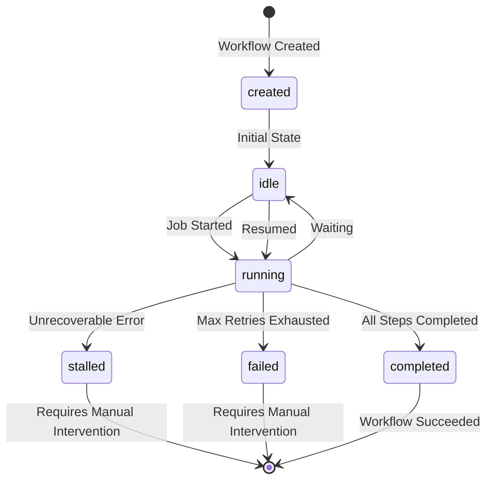

# ChronoForge

[](https://badge.fury.io/rb/chrono_forge)
[](https://github.com/radioactive-labs/chrono_forge/actions/workflows/main.yml)
[](https://opensource.org/licenses/MIT)


> A robust framework for building durable, distributed workflows in Ruby on Rails applications

ChronoForge provides a powerful solution for handling long-running processes, managing state, and recovering from failures in your Rails applications. Built on top of ActiveJob, it ensures your critical business processes remain resilient and traceable.

## 🌟 Features

- **Durable Execution**: Automatically tracks and recovers from failures during workflow execution
- **State Management**: Built-in workflow state tracking with persistent context storage
- **Concurrency Control**: Advanced locking mechanisms to prevent parallel execution of the same workflow
- **Error Handling**: Comprehensive error tracking with configurable retry strategies
- **Execution Logging**: Detailed logging of workflow steps and errors for visibility
- **Wait States**: Support for time-based waits and condition-based waiting
- **Database-Backed**: All workflow state is persisted to ensure durability
- **ActiveJob Integration**: Compatible with all ActiveJob backends, though database-backed processors (like Solid Queue) provide the most reliable experience for long-running workflows

## 📦 Installation

Add to your application's Gemfile:

```ruby
gem 'chrono_forge'
```

Then execute:

```bash
$ bundle install
```

Or install directly:

```bash
$ gem install chrono_forge
```

After installation, run the generator to create the necessary database migrations:

```bash
$ rails generate chrono_forge:install
$ rails db:migrate
```

## 📋 Usage

### Creating and Executing Workflows

ChronoForge workflows are ActiveJob classes that prepend the `ChronoForge::Executor` module. Each workflow can **only** accept keyword arguments:

```ruby
# Define your workflow class
class OrderProcessingWorkflow < ApplicationJob
  prepend ChronoForge::Executor
  
  def perform(order_id:, customer_id:)
    # Workflow steps...
  end
end
```

All workflows require a unique identifier when executed. This identifier is used to track and manage the workflow:

```ruby
# Execute the workflow
OrderProcessingWorkflow.perform_later(
  "order-123",                 # Unique workflow key
  order_id: "order-134",       # Custom kwargs
  customer_id: "customer-456"  # More custom kwargs
)
```

### Basic Workflow Example

Here's a complete example of a durable order processing workflow:

```ruby
class OrderProcessingWorkflow < ApplicationJob
  prepend ChronoForge::Executor

  def perform(order_id:)
    @order_id = order_id

    # Context can be used to pass and store data between executions
    context.set_once "execution_id", SecureRandom.hex

    # Wait until payment is confirmed
    wait_until :payment_confirmed?

    # Wait for potential fraud check
    wait 1.minute, :fraud_check_delay

    # Durably execute order processing
    durably_execute :process_order

    # Final steps
    durably_execute :complete_order
  end

  private

  def payment_confirmed?
    PaymentService.confirmed?(@order_id, context["execution_id"])
  end

  def process_order
    OrderProcessor.process(@order_id, context["execution_id"])
    context["processed_at"] = Time.current.iso8601
  end

  def complete_order
    OrderCompletionService.complete(@order_id, context["execution_id"])
    context["completed_at"] = Time.current.iso8601
  end
end
```

### Core Workflow Features

#### 🚀 Executing Workflows

ChronoForge workflows are executed through ActiveJob's standard interface with a specific parameter structure:

```ruby
# Perform the workflow immediately
OrderProcessingWorkflow.perform_now(
  "order-123",                     # Unique workflow key
  order_id: "O-123",               # Custom parameter
  customer_id: "C-456"             # Another custom parameter
)

# Or queue it for background processing
OrderProcessingWorkflow.perform_later(
  "order-123-async",               # Unique workflow key
  order_id: "O-124",
  customer_id: "C-457"
)
```

**Important:** Workflows must use keyword arguments only, not positional arguments.

#### ⚡ Durable Execution

The `durably_execute` method ensures operations are executed exactly once with automatic retry logic and fault tolerance:

```ruby
# Basic execution
durably_execute :send_welcome_email

# With custom retry attempts
durably_execute :critical_payment_processing, max_attempts: 5

# With custom name for tracking multiple calls to same method
durably_execute :upload_file, name: "profile_image_upload"

# Complex example with error-prone operation
class FileProcessingWorkflow < ApplicationJob
  prepend ChronoForge::Executor

  def perform(file_id:)
    @file_id = file_id
    
    # This might fail due to network issues, rate limits, etc.
    durably_execute :upload_to_s3, max_attempts: 5
    
    # Process file after successful upload
    durably_execute :generate_thumbnails, max_attempts: 3
  end

  private

  def upload_to_s3
    file = File.find(@file_id)
    S3Client.upload(file.path, bucket: 'my-bucket')
    Rails.logger.info "Successfully uploaded file #{@file_id} to S3"
  end

  def generate_thumbnails
    ThumbnailService.generate(@file_id)
  end
end
```

**Key Features:**
- **Idempotent**: Same operation won't be executed twice during replays
- **Automatic Retries**: Failed executions retry with exponential backoff (2^attempt seconds, capped at 32s)
- **Error Tracking**: All failures are logged with detailed error information
- **Configurable**: Customize retry attempts and step naming

#### ⏱️ Wait States

ChronoForge supports three types of wait states, each optimized for different use cases:

**1. Time-based Waits (`wait`)**

For simple delays and scheduled pauses:

```ruby
# Simple delays
wait 30.minutes, "cooling_period"
wait 1.day, "daily_batch_interval"

# Complex workflow with multiple waits
def user_onboarding_flow
  durably_execute :send_welcome_email
  wait 1.hour, "welcome_delay"
  
  durably_execute :send_tutorial_email
  wait 2.days, "tutorial_followup"
  
  durably_execute :send_feedback_request
end
```

**2. Automated Condition Waits (`wait_until`)**

For conditions that can be automatically polled at regular intervals:

```ruby
# Wait for external API
wait_until :external_api_ready?, 
  timeout: 30.minutes, 
  check_interval: 1.minute

# Wait with retry on specific errors
wait_until :database_migration_complete?,
  timeout: 2.hours,
  check_interval: 30.seconds,
  retry_on: [ActiveRecord::ConnectionNotEstablished, Net::TimeoutError]

# Complex condition example
def third_party_service_ready?
  response = HTTParty.get("https://api.example.com/health")
  response.code == 200 && response.body.include?("healthy")
end

wait_until :third_party_service_ready?,
  timeout: 1.hour,
  check_interval: 2.minutes,
  retry_on: [Net::TimeoutError, Net::HTTPClientException]
```

**3. Event-driven Waits (`continue_if`)**

For conditions that depend on external events like webhooks, requiring manual workflow continuation:

```ruby
# Basic usage - wait for webhook-driven state change
continue_if :payment_confirmed?

# With custom name for better tracking
continue_if :payment_confirmed?, name: "stripe_webhook"

# Wait for manual approval
continue_if :document_approved?

# Wait for external file processing
continue_if :processing_complete?

# Multiple waits with same condition but different contexts
continue_if :external_system_ready?, name: "payment_gateway"
# ... other steps ...
continue_if :external_system_ready?, name: "inventory_system"

# Complete workflow example
class PaymentWorkflow < ApplicationJob
  prepend ChronoForge::Executor

  def perform(order_id:)
    @order_id = order_id
    
    # Initialize payment
    durably_execute :create_payment_request
    
    # Wait for external payment confirmation (webhook-driven)
    continue_if :payment_confirmed?, name: "stripe_confirmation"
    
    # Complete order after payment
    durably_execute :fulfill_order
  end

  private

  def payment_confirmed?
    PaymentService.confirmed?(@order_id)
  end
end

# Later, when webhook arrives:
PaymentService.mark_confirmed(order_id)
PaymentWorkflow.perform_later("order-#{order_id}", order_id: order_id)
```

**When to Use Each Wait Type:**

| Wait Type | Use Case | Polling | Resource Usage | Response Time |
|-----------|----------|---------|----------------|---------------|
| `wait` | Fixed delays, rate limiting | None | Minimal | Exact timing |
| `wait_until` | API readiness, data processing | Automatic | Medium | Check interval |
| `continue_if` | Webhooks, user actions, file uploads | Manual only | Minimal | Immediate |

**Key Differences:**

- **`wait`**: Time-based, no condition checking, resumes automatically
- **`wait_until`**: Condition-based with automatic polling, resumes when condition becomes true or timeout
- **`continue_if`**: Condition-based without polling, requires manual workflow retry when condition might have changed

#### 🔄 Periodic Tasks

The `durably_repeat` method enables robust periodic task execution within workflows. Tasks are scheduled at regular intervals until a specified condition is met, with automatic catch-up for missed executions and configurable error handling.

```ruby
class NotificationWorkflow < ApplicationJob
  prepend ChronoForge::Executor

  def perform(user_id:)
    @user_id = user_id
    
    # Send reminders every 3 days until user completes onboarding
    durably_repeat :send_reminder_email, 
      every: 3.days, 
      till: :user_onboarded?
    
    # Critical payment processing every hour - fail workflow if it fails
    durably_repeat :process_pending_payments,
      every: 1.hour,
      till: :all_payments_processed?,
      on_error: :fail_workflow
  end

  private

  def send_reminder_email(scheduled_time = nil)
    # Optional parameter receives the scheduled execution time
    if scheduled_time
      lateness = Time.current - scheduled_time
      Rails.logger.info "Reminder scheduled for #{scheduled_time}, running #{lateness.to_i}s late"
    end
    
    UserMailer.onboarding_reminder(@user_id).deliver_now
  end

  def user_onboarded?
    User.find(@user_id).onboarded?
  end

  def process_pending_payments
    PaymentProcessor.process_pending_for_user(@user_id)
  end

  def all_payments_processed?
    Payment.where(user_id: @user_id, status: :pending).empty?
  end
end
```

**Key Features:**

- **Idempotent Execution**: Each repetition gets a unique execution log, preventing duplicates during replays
- **Automatic Catch-up**: Missed executions due to downtime are automatically skipped using timeout-based fast-forwarding
- **Flexible Timing**: Support for custom start times and precise interval scheduling
- **Error Resilience**: Individual execution failures don't break the periodic schedule
- **Configurable Error Handling**: Choose between continuing despite failures or failing the entire workflow

**Advanced Options:**

```ruby
durably_repeat :generate_daily_report,
  every: 1.day,                          # Execution interval
  till: :reports_complete?,              # Stop condition
  start_at: Date.tomorrow.beginning_of_day, # Custom start time (optional)
  max_attempts: 5,                       # Retries per execution (default: 3)
  timeout: 2.hours,                      # Catch-up timeout (default: 1.hour)
  on_error: :fail_workflow,              # Error handling (:continue or :fail_workflow)
  name: "daily_reports"                  # Custom task name (optional)
```

**Method Parameters:**

Your periodic methods can optionally receive the scheduled execution time as their first argument:

```ruby
# Without scheduled time parameter
def cleanup_files
  FileCleanupService.perform
end

# With scheduled time parameter
def cleanup_files(scheduled_time)
  # Use scheduled time for business logic
  cleanup_date = scheduled_time.to_date
  FileCleanupService.perform(date: cleanup_date)
  
  # Log timing information
  delay = Time.current - scheduled_time
  Rails.logger.info "Cleanup was #{delay.to_i} seconds late"
end
```

#### 🔄 Workflow Context

ChronoForge provides a persistent context that survives job restarts. The context behaves like a Hash but with additional capabilities:

```ruby
# Set context values
context[:user_name] = "John Doe"
context[:status] = "processing"

# Read context values
user_name = context[:user_name]

# Using the fetch method (returns default if key doesn't exist)
status = context.fetch(:status, "pending")

# Set a value with the set method (alias for []=)
context.set(:total_amount, 99.99)

# Set a value only if the key doesn't already exist
context.set_once(:created_at, Time.current.iso8601)

# Check if a key exists
if context.key?(:user_id)
  # Do something with the user ID
end
```

The context supports serializable Ruby objects (Hash, Array, String, Integer, Float, Boolean, and nil) and validates types automatically.

### 🛡️ Error Handling

ChronoForge automatically tracks errors and provides configurable retry capabilities:

```ruby
class MyWorkflow < ApplicationJob
  prepend ChronoForge::Executor

  private

  def should_retry?(error, attempt_count)
    case error
    when NetworkError
      attempt_count < 5  # Retry network errors up to 5 times
    when ValidationError
      false  # Don't retry validation errors
    else
      attempt_count < 3  # Default retry policy
    end
  end
end
```

## 🧪 Testing

ChronoForge is designed to be easily testable using [ChaoticJob](https://github.com/fractaledmind/chaotic_job), a testing framework that makes it simple to test complex job workflows:

1. Add ChaoticJob to your Gemfile's test group:

```ruby
group :test do
  gem 'chaotic_job'
end
```

2. Set up your test helper:

```ruby
# test_helper.rb
require 'chrono_forge'
require 'minitest/autorun'
require 'chaotic_job'
```

Example test:

```ruby
class WorkflowTest < ActiveJob::TestCase
  include ChaoticJob::Helpers

  def test_workflow_completion
    # Enqueue the job with a unique key and custom parameters
    OrderProcessingWorkflow.perform_later(
      "order-test-123",
      order_id: "O-123",
      customer_id: "C-456"
    )
    
    # Perform all enqueued jobs
    perform_all_jobs
    
    # Assert workflow completed successfully
    workflow = ChronoForge::Workflow.find_by(key: "order-test-123")
    assert workflow.completed?
    
    # Check workflow context
    assert workflow.context["processed_at"].present?
    assert workflow.context["completed_at"].present?
  end
end
```

## 🗄️ Database Schema

ChronoForge creates three main tables:

1. **chrono_forge_workflows**: Stores workflow state and context
2. **chrono_forge_execution_logs**: Tracks individual execution steps
3. **chrono_forge_error_logs**: Records detailed error information

## 🔍 When to Use ChronoForge

ChronoForge is ideal for:

- **Long-running business processes** - Order processing, account registration flows
- **Processes requiring durability** - Financial transactions, data migrations
- **Multi-step workflows** - Onboarding flows, approval processes, multi-stage jobs
- **State machines with time-based transitions** - Document approval, subscription lifecycle

## 🧠 Advanced State Management

ChronoForge workflows follow a sophisticated state machine model to ensure durability and fault tolerance. Understanding these states and transitions is essential for troubleshooting and recovery.

### Workflow State Diagram



### State Descriptions

#### Created
- **Description**: Initial state when a workflow record is first created
- **Behavior**: Transitions immediately to idle state
- **Duration**: Momentary

#### Idle
- **Description**: The workflow is waiting to be processed or between processing steps
- **Behavior**: Not locked, available to be picked up by job processor
- **Duration**: Can be minutes to days, depending on wait conditions

#### Running
- **Description**: The workflow is actively being processed
- **Identifiers**: Has locked_at and locked_by values set
- **Behavior**: Protected against concurrent execution
- **Duration**: Should be brief unless performing long operations

#### Completed
- **Description**: The workflow has successfully executed all steps
- **Identifiers**: Has completed_at timestamp, state = "completed"
- **Behavior**: Final state, no further processing
- **Typical Exit Points**: All processing completed successfully

#### Failed
- **Description**: The workflow has failed after exhausting retry attempts
- **Identifiers**: Has failure-related data in error_logs, state = "failed"
- **Behavior**: No automatic recovery, requires manual intervention
- **Typical Exit Points**: Max retries exhausted, explicit failure, non-retryable error

#### Stalled
- **Description**: The workflow encountered an unrecoverable error but wasn't explicitly failed
- **Identifiers**: Not completed, not running, has errors in error_logs
- **Behavior**: Requires manual investigation and intervention
- **Typical Exit Points**: ExecutionFailedError, unexpected exceptions, system failures

### Handling Different Workflow States

#### Recovering Stalled/Failed Workflows

```ruby
workflow = ChronoForge::Workflow.find_by(key: "order-123")

if workflow.stalled? || workflow.failed?
  job_class = workflow.job_class.constantize
  
  # Retry immediately
  job_class.retry_now(workflow.key)
  
  # Or retry asynchronously
  job_class.retry_later(workflow.key)
end
```

#### Monitoring Running Workflows

Long-running workflows might indicate issues:

```ruby
# Find workflows running for too long
long_running = ChronoForge::Workflow.where(state: :running)
                                   .where('locked_at < ?', 30.minutes.ago)

long_running.each do |workflow|
  # Log potential issues for investigation
  Rails.logger.warn "Workflow #{workflow.key} has been running for >30 minutes"
  
  # Optionally force unlock if you suspect deadlock
  # CAUTION: Only do this if you're certain the job is stuck
  # workflow.update!(locked_at: nil, locked_by: nil, state: :idle)
end
```

## 🚀 Development

After checking out the repo, run:

```bash
$ bin/setup                 # Install dependencies
$ bundle exec rake test     # Run the tests
$ bin/appraise              # Run the full suite of appraisals
$ bin/console               # Start an interactive console
```

The test suite uses SQLite by default and includes:
- Unit tests for core functionality
- Integration tests with ActiveJob
- Example workflow implementations

## 👥 Contributing

1. Fork the repository
2. Create your feature branch (`git checkout -b feature/my-new-feature`)
3. Commit your changes (`git commit -am 'Add some feature'`)
4. Push to the branch (`git push origin feature/my-new-feature`)
5. Create a new Pull Request

Please include tests for any new features or bug fixes.

## 📜 License

This gem is available as open source under the terms of the [MIT License](https://opensource.org/licenses/MIT).

## 📚 API Reference

### Core Workflow Methods

| Method | Purpose | Key Parameters |
|--------|---------|----------------|
| `durably_execute` | Execute method with retry logic | `method`, `max_attempts: 3`, `name: nil` |
| `wait` | Time-based pause | `duration`, `name` |
| `wait_until` | Condition-based waiting | `condition`, `timeout: 1.hour`, `check_interval: 15.minutes`, `retry_on: []` |
| `continue_if` | Manual continuation wait | `condition`, `name: nil` |
| `durably_repeat` | Periodic task execution | `method`, `every:`, `till:`, `start_at: nil`, `max_attempts: 3`, `timeout: 1.hour`, `on_error: :continue` |

### Context Methods

| Method | Purpose | Example |
|--------|---------|---------|
| `context[:key] = value` | Set context value | `context[:user_id] = 123` |
| `context[:key]` | Get context value | `user_id = context[:user_id]` |
| `context.set(key, value)` | Set context value (alias) | `context.set(:status, "active")` |
| `context.set_once(key, value)` | Set only if key doesn't exist | `context.set_once(:created_at, Time.current)` |
| `context.fetch(key, default)` | Get with default value | `context.fetch(:count, 0)` |
| `context.key?(key)` | Check if key exists | `context.key?(:user_id)` |

