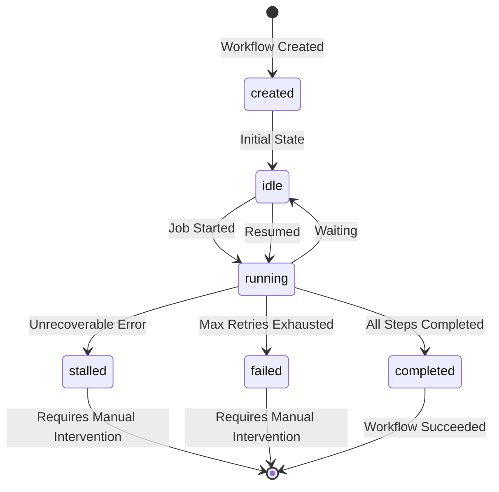

# ChronoForge

[](https://badge.fury.io/rb/chrono_forge)
[](https://github.com/radioactive-labs/chrono_forge/actions/workflows/main.yml)
[](https://opensource.org/licenses/MIT)

**Your background job works until the process it drives has to survive a crash,
wait three days, and resume exactly where it stopped.** ChronoForge is the
durable-workflow engine that makes plain Ruby do that.

The moment a job outgrows a single run, the edge cases arrive one at a time: a
step commits its side effect but the worker is OOM-killed before the next one, so
a naive retry runs it twice. A process needs to pause for three days until a
webhook lands, without pinning a worker. A flaky API call needs bounded retries
with backoff, not an infinite loop. A branch of the flow only exists for some
inputs, and a loop runs once per row in a set you can't see until runtime. And
sooner or later support asks "did step four actually run?", and you need the
answer. ChronoForge persists every step, recovers from failures, waits durably on
time and conditions, fans out into concurrent child workflows, and keeps a
queryable history of all of it.

It is a gem over your existing database and ActiveJob backend: no DSL to learn,
no separate server or daemon to run. Workflows are ordinary Ruby methods, so
`if`/`else`, loops, early returns, and helper methods drive the flow the way they
always do. Works with any ActiveJob backend on Rails 7.1+.

> [!NOTE]
> **In production at achieve by Petra**, an investment platform in the Petra
> Group, where it has executed over 3.6 million workflows and 32 million durable
> steps across scheduled payments, investment rollovers, and membership lifecycle
> management.

## 30-second tour

A workflow is an ActiveJob class that prepends `ChronoForge::Executor`. Each
durable step is just a method, and the primitives (`durably_execute`, `wait`,
`wait_until`, `durably_repeat`) run inline between them:

```ruby
class OnboardingWorkflow < ApplicationJob
  prepend ChronoForge::Executor

  def perform(user_id:)
    @user_id = user_id

    durably_execute :send_welcome_email
    wait 2.days, :remind_delay
    durably_execute :remind_of_tasks
    wait 15.days, :onboarding_delay
    durably_execute :complete_onboarding
  end

  private

  def send_welcome_email = UserMailer.welcome(@user_id).deliver_now
  def remind_of_tasks = UserMailer.task_reminder(@user_id).deliver_now
  def complete_onboarding = User.find(@user_id).complete_onboarding!
end
```

Run it with a unique key that identifies this run for its whole life:

```ruby
OnboardingWorkflow.perform_later("onboard-user-42", user_id: 42)
```

The 2-day and 15-day waits hold no worker: the workflow persists its position and
resumes on schedule. Each `durably_execute` is checkpointed by step name, so a
crash and resume skip the steps that already completed and pick up at the one
that didn't. ChronoForge handles the rest: retries with backoff, concurrency
locking, durable state, and a full step history you can inspect in the
[dashboard](#dashboard).

## Why plain Ruby

Most Rails workflow tools ask you to declare your steps up front in a DSL:

```ruby
step :send_welcome_email
step :remind_of_tasks, wait: 2.days
step :complete_onboarding, wait: 15.days
```

That reads cleanly for a fixed, linear sequence. But many business processes
branch, loop, and react to data that only exists at runtime, and a declarative
schema gets awkward there. ChronoForge takes the opposite approach: the workflow
is plain Ruby, and each step is a method. Conditionals, iteration, early returns,
and helper methods all work the way they normally do:

```ruby
class OrderProcessingWorkflow < ApplicationJob
  prepend ChronoForge::Executor

  def perform(order_id:)
    @order_id = order_id

    wait_until :payment_confirmed?
    durably_execute :validate_order

    # Runtime branching: the path depends on data known only at execution time
    if context["requires_compliance_check"]
      durably_execute :run_compliance_review
      wait_until :compliance_approved?, timeout: 48.hours
    end

    # Iterate over runtime data: one durable, idempotent step per item
    context["line_item_ids"].each do |item_id|
      context["current_item_id"] = item_id
      durably_execute :fulfill_item, name: "fulfill_#{item_id}"
    end

    # Recurring notification: nudge the customer until they confirm delivery
    durably_repeat :send_delivery_reminder, every: 3.days, till: :delivery_confirmed?

    durably_execute :complete_order
  end

  private

  def fulfill_item
    FulfillmentService.fulfill(@order_id, context["current_item_id"])
  end

  def send_delivery_reminder
    OrderMailer.delivery_reminder(@order_id).deliver_later
  end

  # ... condition and step methods ...
end
```

A fixed, declared list of steps can't easily express a runtime branch, a loop
over a runtime-sized collection, and an open-ended recurring notification. Here
they are ordinary control flow. Each `durably_execute` is still checkpointed by
its step name, so on resume the completed branches and items are skipped and the
workflow continues where it left off.

There is one trade-off, though a smaller one than it used to be. A declarative
engine can show the steps a run *hasn't* reached yet; plain imperative code
can't. The [definition graph](#dashboard) closes most of that gap: it reads your
`perform` with Prism (without running it) and draws the steps the run will take,
with live status on each. For a simple fixed sequence a declarative DSL can still
read more cleanly, and that's a fine reason to use one.

## Installation

Add to your application's Gemfile:

```ruby
gem "chrono_forge"
```

Then install and migrate:

```bash
bundle install
rails generate chrono_forge:install
rails db:migrate
```

### Upgrading

When upgrading in an application installed with an earlier version, run the
upgrade generator to pick up any additive schema changes, then migrate:

```bash
rails generate chrono_forge:upgrade
rails db:migrate
```

Re-running the generator is safe: it skips migrations you already have. Fresh
installs get everything from `chrono_forge:install` and don't need the upgrade.

## Dashboard

ChronoForge ships a free, mountable dashboard for visibility and recovery:
workflow list, step-replay timeline, a per-run **definition graph** (the durable
steps a run will take, statically parsed from `perform`, with live status
overlaid), context inspector, periodic-task health, wait-state age, and
retry/unlock/reap actions. It is a separate gem, `chrono_forge-dashboard`, so the
core stays lean.

```ruby
# Gemfile
gem "chrono_forge-dashboard"

# config/routes.rb
mount ChronoForge::Dashboard::Engine, at: "/chrono_forge"
```

[](chrono_forge-dashboard/README.md#screenshots)

The per-run definition graph shows the steps a workflow will run, read from
`perform`, with the run's status painted on each node:

[](chrono_forge-dashboard/README.md#screenshots)

See [`chrono_forge-dashboard`](chrono_forge-dashboard/README.md) for setup,
authentication, and [more screenshots](chrono_forge-dashboard/README.md#screenshots).

## Defining and running workflows

A workflow is an ActiveJob class that prepends `ChronoForge::Executor`. Its
`perform` accepts keyword arguments **only**, never positional ones:

```ruby
class OrderProcessingWorkflow < ApplicationJob
  prepend ChronoForge::Executor

  def perform(order_id:, customer_id:)
    # Workflow steps...
  end
end
```

Every run is identified by a unique key, passed as the first positional argument
ahead of your kwargs. The key tracks and manages the run for its whole life, and
is how ChronoForge finds the record on resume:

```ruby
# Queue it for background processing (the common case)
OrderProcessingWorkflow.perform_later(
  "order-123",                 # unique workflow key
  order_id: "O-124",           # your kwargs follow
  customer_id: "C-457"
)

# Or run it inline (console/debugging)
OrderProcessingWorkflow.perform_now("order-123", order_id: "O-124", customer_id: "C-457")
```

Here is a complete linear workflow, using [context](#workflow-context) to carry
state between executions:

```ruby
class OrderProcessingWorkflow < ApplicationJob
  prepend ChronoForge::Executor

  def perform(order_id:)
    @order_id = order_id

    # Context stores data that survives across executions
    context.set_once "execution_id", SecureRandom.hex

    wait_until :payment_confirmed?     # wait for payment
    wait 1.minute, :fraud_check_delay  # pause for a fraud check
    durably_execute :process_order
    durably_execute :complete_order
  end

  private

  def payment_confirmed?
    PaymentService.confirmed?(@order_id, context["execution_id"])
  end

  def process_order
    OrderProcessor.process(@order_id, context["execution_id"])
    context["processed_at"] = Time.current.iso8601
  end

  def complete_order
    OrderCompletionService.complete(@order_id, context["execution_id"])
    context["completed_at"] = Time.current.iso8601
  end
end
```

ChronoForge works with any ActiveJob backend, though database-backed processors
(like Solid Queue) give the most reliable experience for long-running workflows.

## Durable execution

`durably_execute` runs a method with automatic retries and skips it on replay
once it has completed:

```ruby
# Basic execution
durably_execute :send_welcome_email

# With a custom retry policy
durably_execute :critical_payment_processing,
  retry_policy: RetryPolicy.new(max_attempts: 5)

# With a custom name, to track multiple calls to the same method
durably_execute :upload_file, name: "profile_image_upload"
```

Each call is:

- **Idempotent on replay.** A completed step won't run a second time when the
  workflow resumes.
- **Retried on failure.** Failed executions retry per a unified `RetryPolicy`
  (exponential backoff with jitter; the step default caps at 30s over 3 attempts).
- **Logged.** Every failure is recorded with detailed error information,
  attributed to the step and attempt that raised it.
- **Configurable.** Pass a `retry_policy:` per call, or set a class-wide default
  with the `retry_policy` DSL (see [Retry policies](#retry-policies)).

> **Write your side effects to be idempotent.** A step short-circuits on replay
> only once its log row reaches `completed`. If a worker is hard-killed
> (SIGKILL/OOM/eviction) *after* a step's side effect commits but *before* its log
> is marked `completed`, the step re-runs when the workflow resumes (including by
> the [reaper](#recovering-stranded-workflows)). Make external side effects safe to
> repeat: use a natural/unique key with `create_or_find_by`, an upsert, or a rescue
> on the uniqueness violation, rather than assuming exactly-once execution.

## Retry policies

All retrying in ChronoForge goes through a single `RetryPolicy`
(`ChronoForge::Executor::RetryPolicy`). It answers two questions: *should this
failure be retried?* and *how long until the next attempt?*

```ruby
RetryPolicy.new(
  max_attempts: 3,   # cap on total attempts; nil = no count cap (bounded elsewhere)
  base: 1,           # seconds; delay of the first retry
  cap: 30,           # seconds; ceiling for a single delay
  jitter: true,      # spread retries with equal jitter
  retry_on: nil      # nil = retry any StandardError; [Classes] = only those; [] = none
)
```

Backoff is exponential with equal jitter, computed once at re-enqueue time (never
replayed, so it stays deterministic where it matters). To make an error
non-retryable, leave it out of `retry_on:` (an empty `retry_on: []` retries
nothing).

**Resolution order:**

- `durably_execute`, `durably_repeat`, and workflow-level errors: per-call
  `retry_policy:`, then the class-level `retry_policy` default, then the built-in
  default.
- `wait_until`: per-call `retry_policy:`, then a built-in default that **retries
  nothing** (not the step default). It deliberately does **not** fall back to the
  class-level default, so a class-wide "retry everything" can't silently turn a
  condition-evaluation bug into a retried error. Opt specific errors back in with a
  per-call `retry_policy:` (`retry_on: [...]`).

**Built-in defaults:**

| Site | Default | Why |
|------|---------|-----|
| Steps (`durably_execute`/`durably_repeat`) | 3 attempts, cap 30s, retry any error | flaky calls fail fast |
| Workflow-level (uncaught errors) | 10 attempts, cap 600s, retry any error | tolerant window up to ~8.5 min (≈4 min typical with jitter) for transient infra errors; each retry replays the whole workflow from the top |
| `wait_until` condition errors | retry nothing | a raised condition is usually a bug, not transient |

**Class-wide default via the `retry_policy` DSL:**

```ruby
class ChargeWorkflow < ApplicationJob
  prepend ChronoForge::Executor
  retry_policy max_attempts: 5, base: 2, cap: 60   # applies to steps + workflow-level

  def perform
    durably_execute :charge,
      retry_policy: RetryPolicy.new(max_attempts: 8, retry_on: [Net::OpenTimeout])
    wait_until :settled?,
      retry_policy: RetryPolicy.new(retry_on: [BankApiError])
  end
end
```

**Composite policies (per-error budgets):**

Pass an **array** of policies to handle different error types differently. On a
failure, the **first** policy whose `retry_on` matches the raised error applies,
and each error type gets its own attempt budget and backoff:

```ruby
durably_execute :charge_card, retry_policy: [
  RetryPolicy.new(retry_on: [NetworkError],         max_attempts: 5),            # transient: retry hard
  RetryPolicy.new(retry_on: [RateLimitError],       max_attempts: 10, base: 5),  # back off longer
  RetryPolicy.new(retry_on: [PaymentDeclinedError], max_attempts: 1),            # fail fast, never retry
  RetryPolicy.new(retry_on: nil)                                                 # catch-all (optional), keep last
]
```

- **Order matters:** the first matching policy wins, so list specific errors
  first and a catch-all (`retry_on: nil`) last. An error matched by no policy is
  **not** retried (fails fast).
- A subclass of a listed error routes to that policy and draws from its budget.
- Per-error counts are tracked by the policy's declared errors, so the budgets
  are stable even if you reorder the list.
- The class-level DSL accepts the same array form as positional arguments,
  applying to steps **and** workflow-level errors:

  ```ruby
  retry_policy RetryPolicy.new(retry_on: [NetworkError], max_attempts: 5),
               RetryPolicy.new(retry_on: nil, max_attempts: 2)
  ```

## Wait states

ChronoForge supports three kinds of wait, each suited to a different trigger. All
three survive restarts: the workflow persists its position and holds no worker
while it waits.

| Wait | Use case | Polling | Resumes |
|------|----------|---------|---------|
| `wait` | Fixed delays, rate limiting, scheduled pauses | none | automatically, on schedule |
| `wait_until` | API readiness, data processing | automatic, at `check_interval` | when the condition is true, or on timeout |
| `continue_if` | Webhooks, user actions, file uploads | none | when you re-enqueue the workflow |

### `wait`: time-based

For simple delays and scheduled pauses. Each wait is named so it is checkpointed
independently:

```ruby
wait 30.minutes, "cooling_period"
wait 1.day, "daily_batch_interval"
```

### `wait_until`: automated condition polling

For conditions that can be polled on an interval. ChronoForge re-checks the
condition until it is true or the timeout elapses:

```ruby
wait_until :external_api_ready?,
  timeout: 30.minutes,
  check_interval: 1.minute

# Retry specific errors raised while evaluating the condition
wait_until :database_migration_complete?,
  timeout: 2.hours,
  check_interval: 30.seconds,
  retry_policy: RetryPolicy.new(retry_on: [ActiveRecord::ConnectionNotEstablished, Net::TimeoutError])
```

The condition is an ordinary method:

```ruby
def third_party_service_ready?
  response = HTTParty.get("https://api.example.com/health")
  response.code == 200 && response.body.include?("healthy")
end
```

### `continue_if`: event-driven, no polling

For conditions that only change on an external event (a webhook, a manual
approval, a finished upload). ChronoForge does not poll; the workflow waits until
something re-enqueues it, then re-checks the condition:

```ruby
class PaymentWorkflow < ApplicationJob
  prepend ChronoForge::Executor

  def perform(order_id:)
    @order_id = order_id

    durably_execute :create_payment_request
    continue_if :payment_confirmed?, name: "stripe_confirmation"  # webhook-driven
    durably_execute :fulfill_order
  end

  private

  def payment_confirmed?
    PaymentService.confirmed?(@order_id)
  end
end

# Later, when the webhook arrives, mark the state and re-enqueue:
PaymentService.mark_confirmed(order_id)
PaymentWorkflow.perform_later("order-#{order_id}", order_id: order_id)
```

The optional `name:` distinguishes multiple waits on the same condition:

```ruby
continue_if :external_system_ready?, name: "payment_gateway"
# ... other steps ...
continue_if :external_system_ready?, name: "inventory_system"
```

## Periodic tasks

`durably_repeat` runs a step on a schedule until a condition holds, with
automatic catch-up for missed runs. A workflow can be its own recurring job and
cron-style monitor, right alongside the rest of its logic:

```ruby
class NotificationWorkflow < ApplicationJob
  prepend ChronoForge::Executor

  def perform(user_id:)
    @user_id = user_id

    # Remind every 3 days until the user finishes onboarding
    durably_repeat :send_reminder_email,
      every: 3.days,
      till: :user_onboarded?

    # Process payments hourly; fail the workflow if a run fails
    durably_repeat :process_pending_payments,
      every: 1.hour,
      till: :all_payments_processed?,
      on_error: :fail_workflow
  end

  private

  def send_reminder_email
    UserMailer.onboarding_reminder(@user_id).deliver_now
  end

  def user_onboarded?
    User.find(@user_id).onboarded?
  end

  def process_pending_payments
    PaymentProcessor.process_pending_for_user(@user_id)
  end

  def all_payments_processed?
    Payment.where(user_id: @user_id, status: :pending).empty?
  end
end
```

Each repetition gets its own execution log, so replays never double up. Missed
executions (from downtime) are skipped by timeout-based fast-forwarding rather
than fired all at once, and an individual failure doesn't break the schedule.

**All options:**

```ruby
durably_repeat :generate_daily_report,
  every: 1.day,                              # execution interval
  till: :reports_complete?,                  # stop condition
  start_at: Date.tomorrow.beginning_of_day,  # custom start time (optional)
  retry_policy: RetryPolicy.new(max_attempts: 5), # per-execution policy (default: step default)
  timeout: 2.hours,                          # catch-up timeout (default: 1.hour)
  on_error: :fail_workflow,                  # :continue (default) or :fail_workflow
  name: "daily_reports"                      # custom task name (optional)
```

A periodic method can optionally receive the scheduled execution time as its
first argument, which is useful for both business logic and lateness logging:

```ruby
def cleanup_files(scheduled_time)
  FileCleanupService.perform(date: scheduled_time.to_date)
  Rails.logger.info { "Cleanup ran #{(Time.current - scheduled_time).to_i}s late" }
end
```

## Branches: parallel sub-workflows

When a workflow needs to fan out (process every pending order, reconcile each
region), `branch` spawns child workflows that run concurrently and join when their
results are needed:

```ruby
branch :reconcile, automerge: true do
  spawn :eu, ReconcileWorkflow, region: "EU"
  spawn_each :orders, Order.pending do |order|
    [OrderWorkflow, { order_id: order.id }]
  end
end
```

### Model

- **`branch :name do … end`** opens a named branch (a durable step). Inside the
  block, `spawn` and `spawn_each` create and immediately enqueue child workflows;
  children start running as soon as the branch block is entered.
- **`spawn :name, WorkflowClass, **kwargs`** enqueues one child workflow.
- **`spawn_each :name, source do |item| [WorkflowClass, kwargs] end`** enqueues one
  child per item. The block returns the class and kwargs, so one branch can fan
  out into mixed workflow types. Sources are iterated in constant memory;
  ActiveRecord relations are streamed by primary key, so pass them **without** an
  explicit `.order`.
- **`automerge: true`** joins the branch **inline at the block's close**.
  Execution does not continue past the `branch` call until every child has
  completed. Use it for "dispatch this group and wait right here."
- **`merge_branches :a, :b`** (singular alias `merge_branch :a`) is the separate
  join point. Open branches without `automerge`, do other work while the children
  run, then join when you need their results. `merge_branches` blocks until all
  named branches are complete.

### Worked example

```ruby
class FulfillmentWorkflow < ApplicationJob
  prepend ChronoForge::Executor

  def perform(cycle_id:)
    # automerge: the branch is joined inline, right where the block closes.
    # `perform` does not continue past it until every child has completed.
    branch :reconcile, automerge: true do
      spawn :eu, ReconcileWorkflow, region: "EU"
      spawn_each :orders, Order.pending do |order|
        order.priority? ? [PriorityOrderWorkflow, { order_id: order.id }]
                        : [OrderWorkflow, { order_id: order.id }]
      end
    end

    # To run branches concurrently and join later, omit automerge and use
    # merge_branches:
    branch :invoices do
      spawn_each :unpaid, Invoice.unpaid do |inv|
        [InvoiceWorkflow, { invoice_id: inv.id }]
      end
    end
    branch :shipments do
      spawn_each :ready, Shipment.ready do |s|
        [ShipmentWorkflow, { shipment_id: s.id }]
      end
    end
    do_other_work                        # runs while :invoices and :shipments dispatch/run
    merge_branches :invoices, :shipments # join both here

    durably_execute :finalize
  end
end
```

### Caveats

> **Every branch must be joined.** A branch opened and never joined raises
> `ChronoForge::Executor::UnmergedBranchError` when the workflow tries to
> complete: fail-fast, no silently-orphaned children. Use either `automerge: true`
> or a matching `merge_branches` call.

> **The parent isn't replayed while waiting.** A lightweight
> `ChronoForge::BranchMergeJob` polls for child completion; the parent runs again
> only once the branch is fully done. Polling cadence tracks the estimated
> time-to-drain (measured from the children's completion rate), so the parent
> wakes within ~`min_interval` of the last child finishing rather than up to
> `max_interval` late. A branch that can only wait, or is blocked on a failure,
> backs off to `max_interval`.
>
> **Queue placement matters.** The poller is enqueued *after* the branch's
> children, so on a queue those children saturate it starves behind the backlog
> (the parent then converges up to `max_interval` late). Point it at a queue that
> isn't saturated by the fan-out:
>
> ```ruby
> ChronoForge.configure { |c| c.branch_merge_queue = :chrono_forge_pollers } # default: :default
> ```

> **`spawn_each` sources must re-enumerate deterministically across replays.**
> ActiveRecord relations are streamed by primary key (children are keyed by record
> id, so crash-resume is idempotent); a relation carrying an explicit `.order(...)`
> raises. For non-AR enumerables, items are keyed by position, so inserting or
> removing items mid-dispatch would shift keys and break idempotency.

> **`spawn_each` AR sources must have stable membership.** Dispatch streams by
> ascending primary key and resumes from the last key on crash-recovery, so a row
> that enters the relation *below* the cursor after it has passed (e.g. a
> `where(state: …)` scope whose rows mutate mid-dispatch) will never get a child.
> Point `spawn_each` at a set fixed for the branch's lifetime: a frozen id range,
> an append-only table, or `where(id: [...])` over a snapshot.

> **`branch` blocks cannot be lexically nested within one workflow.** Opening a
> `branch` inside another `branch` block raises `ArgumentError`; spawns belong to
> exactly one branch. (A *spawned child workflow* may open its own branches, since
> it runs in its own executor, so cross-workflow nesting is fine.)

Verified correct at 500,000 children on a single Postgres instance; a follow-up
commit-consolidation change halved per-child execution time. See the
[scale test](docs/fanout-scale-test.md).

## Workflow context

ChronoForge provides a persistent context that survives job restarts. It behaves
like a Hash, with a few extra methods:

```ruby
context[:user_name] = "John Doe"             # set
user_name = context[:user_name]              # read
status = context.fetch(:status, "pending")   # read with default
context.set(:total_amount, 99.99)            # set (alias for []=)
context.set_once(:created_at, Time.current.iso8601)  # set only if absent
context.merge(status: "processing", attempts: 0)     # set several (alias: set_multiple)
context.merge_once(created_at: Time.current.iso8601) # set several, skip existing (alias: set_multiple_once)
context.key?(:user_id)                       # existence check
```

Context supports serializable Ruby values (Hash, Array, String, Integer, Float,
Boolean, nil) and validates types automatically. Hash and Array values are stored
as JSON, which has no symbols, so **symbol keys inside a stored hash come back as
strings**:

```ruby
context[:totals] = { paid: 5, pending: 2 }
context[:totals]          # => { "paid" => 5, "pending" => 2 }
context[:totals]["paid"]  # => 5   (not context[:totals][:paid])
```

(The top-level context key itself is interchangeable: `context[:totals]` and
`context["totals"]` refer to the same entry.)

Context is for **small working state**: ids, flags, timestamps, and small
structures used to coordinate steps. Each value is capped at **16 KB** (a
`ChronoForge::Executor::Context::ValidationError` is raised above that). Store
large payloads (documents, uploads, API responses) in their own storage and keep
just a reference (an id or key) in the context.

## Testing

ChronoForge is designed to be tested with
[ChaoticJob](https://github.com/fractaledmind/chaotic_job), a framework for
testing complex job workflows. Add it to your test group:

```ruby
group :test do
  gem "chaotic_job"
end
```

Set up your test helper:

```ruby
# test_helper.rb
require "chrono_forge"
require "minitest/autorun"
require "chaotic_job"
```

Then enqueue a workflow, run every enqueued job, and assert on the persisted
result:

```ruby
class WorkflowTest < ActiveJob::TestCase
  include ChaoticJob::Helpers

  def test_workflow_completion
    OrderProcessingWorkflow.perform_later("order-test-123", order_id: "O-123", customer_id: "C-456")

    perform_all_jobs

    workflow = ChronoForge::Workflow.find_by(key: "order-test-123")
    assert workflow.completed?
    assert workflow.context["processed_at"].present?
    assert workflow.context["completed_at"].present?
  end
end
```

## Workflow states and recovery

A workflow moves through a state machine. Knowing the states makes troubleshooting
and recovery straightforward.


```mermaid
stateDiagram-v2
    [*] --> created: Workflow Created
    created --> idle: Initial State
    idle --> running: Job Started
    running --> idle: Waiting
    running --> completed: All Steps Completed
    running --> failed: Max Retries Exhausted
    running --> stalled: Unrecoverable Error
    idle --> running: Resumed
    stalled --> [*]: Requires Manual Intervention
    failed --> [*]: Requires Manual Intervention
    completed --> [*]: Workflow Succeeded
```

| State | Meaning |
|-------|---------|
| `created` | Initial record; transitions immediately to `idle`. Momentary. |
| `idle` | Waiting to be processed or between steps. Not locked, available to the job processor. Can last minutes to days, depending on wait conditions. |
| `running` | Actively being processed. Has `locked_at`/`locked_by` set; protected against concurrent execution. Should be brief unless a step is genuinely long. |
| `completed` | All steps succeeded. Has `completed_at`; final state, no further processing. |
| `failed` | Exhausted retry attempts (or hit an explicit/non-retryable failure). Has failure data in `error_logs`; no automatic recovery. |
| `stalled` | Hit an unrecoverable error but wasn't explicitly failed. Not completed, not running, has errors in `error_logs`. Requires investigation. |

### Recovering stalled or failed workflows

Re-run a `stalled` or `failed` workflow directly from its record. Execution
resumes by replay, so completed steps are skipped and it picks up where it failed:

```ruby
workflow = ChronoForge::Workflow.find_by(key: "order-123")

workflow.retry_later   # re-run asynchronously (the common case)
workflow.retry_now     # re-run inline (console/debugging)
```

Only `stalled` or `failed` workflows are retryable. Both methods validate up
front, so calling `retry_later` on a non-retryable workflow raises
`ChronoForge::Executor::WorkflowNotRetryableError` immediately rather than
enqueuing a job that would fail in the worker:

```ruby
workflow.retryable?   # => true/false

# Bulk re-run everything that failed:
ChronoForge::Workflow.failed.find_each(&:retry_later)
```

The class-level form (`MyWorkflow.retry_now(key)` / `retry_later(key)`) works too
if you have the class and key rather than the record.

### Recovering stranded workflows

When a worker is **hard-killed** mid-pass (SIGKILL from a deploy/rollout, an OOM
kill, a node eviction, or a Solid Queue heartbeat prune), Ruby's `ensure` block
does not run. The executor releases the lock and publishes the resume continuation
in that `ensure`, so a hard kill leaves the workflow stuck in `running` with a
stale lock **and** nothing scheduled to wake it. It is fully resumable (a resuming
pass steals the stale lock and replays completed steps as no-ops), but nothing
re-enqueues it on its own: `retry_now`/`retry_later` refuse a `running` workflow,
and a dashboard "force unlock" clears the lock but enqueues no job.

`ChronoForge::Workflow.reap_stalled` reconciles these. It finds every `running`
workflow whose lock is older than `reap_stale_after` (top-level workflows **and**
branch children) and re-enqueues it, returning the number reaped:

```ruby
ChronoForge::Workflow.reap_stalled
# => 3   (also logs "ChronoForge reaped 3 stalled workflow(s)")

# Override the threshold for a one-off sweep:
ChronoForge::Workflow.reap_stalled(stale_after: 15.minutes)
```

It is **not** run automatically: schedule it from your own scheduler, the same way
you schedule `ChronoForge::Cleanup`. For example, a Solid Queue recurring task:

```yaml
# config/recurring.yml
reap_stalled_workflows:
  command: "ChronoForge::Workflow.reap_stalled"
  schedule: "every 5 minutes"
```

Re-enqueue is safe under concurrency: overlapping sweeps (or a re-enqueue landing
while the old stale lock still shows) at worst enqueue a duplicate, which loses the
lock-acquisition race and no-ops. Because reaping replays the interrupted pass,
steps with external side effects must be idempotent (see the note under
[Durable execution](#durable-execution)).

`reap_stale_after` defaults to **3× `max_duration`** (30 minutes out of the box).
Both are configurable, and because the reap threshold derives from `max_duration`
it always stays safely above the lock-steal threshold: raise one and the other
follows.

```ruby
ChronoForge.configure do |c|
  c.max_duration     = 10.minutes  # how long one pass may hold its lock before it's stealable
  c.reap_stale_after = 45.minutes  # optional: pin the reap threshold explicitly (else 3x max_duration)
end
```

> **Not covered:** a workflow parked on a branch merge whose `BranchMergeJob`
> poller was itself hard-killed sits `idle` (not `running`), so the reaper does not
> sweep it. That is a distinct failure mode.

## Cleanup and retention

ChronoForge keeps every workflow and execution-log row indefinitely so replays
stay idempotent. Over time two things grow without bound:

1. **Terminal workflows** (`completed` / `failed`) that are no longer needed.
2. **`durably_repeat` repetition logs**: one row per scheduled execution. A
   long-lived periodic workflow never reaches a terminal state, so its repetition
   logs accumulate indefinitely. Past repetitions (behind the task's current
   frontier) are never read again, since each resume recomputes the next execution
   from the coordination log, so they are safe to prune.

`ChronoForge::Cleanup` reclaims both. It is **not** run automatically; schedule it
so you stay in control of retention:

```ruby
ChronoForge::Cleanup.run(
  older_than: 90.days,                       # default retention for terminal workflows (+ cascades their logs)
  completed_older_than: 30.days,             # optional: retention for completed workflows (defaults to older_than)
  failed_older_than: 180.days,               # optional: keep failures longer for debugging (defaults to older_than)
  prune_repetition_logs_older_than: 30.days, # opt-in: prune old durably_repeat logs from still-active workflows
  batch_size: 1_000                          # rows deleted per batch
)
# => { workflows: 12, execution_logs: 84, error_logs: 3, repetition_logs: 240 }
```

- `running`, `idle`, and `stalled` workflows are **never** deleted.
- `completed_older_than` / `failed_older_than` let you keep failed workflows around
  longer than completed ones; both default to `older_than`.
- `prune_repetition_logs_older_than` is opt-in (defaults to `nil`); when unset,
  repetition logs are only removed as part of deleting their parent workflow.
  Pruning is deliberately conservative: it removes only terminal repetition logs
  that are both older than the window **and** scheduled strictly before the
  periodic task's current frontier (the coordination log's `last_execution_at`).
  Anything at or after the frontier is kept, so `durably_repeat`'s catch-up
  mechanism is never disrupted and the window is safe even for yearly schedules.
- Workflow retention is measured from when a workflow became terminal, not when it
  was created. Completed workflows use `completed_at` (immutable); failed workflows
  use `updated_at` (they have no `completed_at`).
- The composite `[state, completed_at]` index added in this version keeps these
  scans efficient; run `chrono_forge:upgrade` if you installed an earlier version.

A ready-made job is bundled so any recurring-job mechanism can drive it (Solid
Queue recurring tasks, sidekiq-cron, GoodJob cron, the `whenever` gem, and so on).
It takes plain day counts, not `Duration` objects, so it can be driven from a
config file:

```yaml
# config/recurring.yml
production:
  chrono_forge_cleanup:
    class: ChronoForge::CleanupJob
    args: { older_than_days: 90, prune_repetition_logs_older_than_days: 30 }
    schedule: every day at 3am
```

## Database schema

ChronoForge creates three tables:

| Table | Holds |
|-------|-------|
| `chrono_forge_workflows` | Workflow state and context |
| `chrono_forge_execution_logs` | Individual execution steps |
| `chrono_forge_error_logs` | Detailed error information |

## When to use ChronoForge

ChronoForge fits processes that outlive a single job run:

- **Long-running business processes:** order processing, account registration.
- **Processes that need durability:** financial transactions, data migrations.
- **Multi-step workflows:** onboarding, approvals, multi-stage jobs.
- **State machines with time-based transitions:** document approval, subscription
  lifecycle.

## How it compares

There are several ways to run durable or multi-step work from a Rails app.
ChronoForge aims to be the procedural, no-extra-infrastructure option with a real
dashboard.

|                              | ChronoForge          | AJ Continuations           | GenevaDrive        | AcidicJob       | Temporal        |
| ---------------------------- | -------------------- | -------------------------- | ------------------ | --------------- | --------------- |
| Programming model            | procedural (plain Ruby) | procedural (`step` blocks) | declarative DSL | declarative DSL | procedural (via SDK) |
| Built-in periodic tasks      | ✓ `durably_repeat`   | ✗                          | ✗                  | ✗               | ✓               |
| Parallel sub-workflows       | ✓ `branch` / `spawn` | ✗                          | ✗                  | ✗               | ✓               |
| Pending-step visibility      | ✗ (procedural)       | ✗ (procedural)             | ✓                  | ✓               | ✗ (procedural)  |
| Web dashboard                | ✓ (free gem)         | job-level (Mission Control)| paid only          | ✗               | ✓               |
| Extra infrastructure         | none (DB + ActiveJob)| none (built into Rails)    | none               | none            | server required |
| Rails support                | 7.1+                 | 8.1+                       | 7.2+               | 7.1+            | any (Ruby SDK)  |
| License                      | MIT                  | MIT                        | LGPL / commercial  | MIT             | MIT             |

<sub>Comparison reflects each project's documented features as of mid-2026, to the
best of our knowledge; corrections welcome via PR.</sub>

A few deliberate choices behind that table:

- **Periodic tasks are built in.** `durably_repeat` runs a step on a schedule until
  a condition holds, with automatic catch-up for missed runs, so a workflow can be
  its own recurring job and cron-style monitor. Without built-in support, periodic
  behavior usually lives in a separate scheduler you reconcile with workflow state
  by hand.
- **No extra infrastructure.** ChronoForge is a gem over your existing database and
  ActiveJob backend. There is no separate server or daemon to operate, unlike
  Temporal.
- **Large-scale fan-out is built in.** `branch` with `spawn`/`spawn_each` fans a
  workflow out into concurrent child workflows that join when their results are
  needed, streaming ActiveRecord relations in constant memory for large sets. Among
  the Ruby-native engines here, only ChronoForge offers this without a separate
  orchestration server (Temporal does, server-side).
- **Recovery is built into the model.** Steps are append-only history, so a crashed
  step leaves the workflow `stalled`, recoverable directly with `retry_later`.
- **A real dashboard, free.** The [mountable dashboard](#dashboard) ships as a
  separate MIT gem: workflow list, step-replay timeline, per-run definition graph,
  context inspector, retry/unlock/reap.
- **MIT licensed.** Permissive and dependency-policy-friendly.

**ActiveJob Continuations solve a narrower problem.** Rails 8.1's built-in
[continuations](https://api.rubyonrails.org/classes/ActiveJob/Continuation.html)
make a *single* long job survive interruptions: you wrap work in `step` blocks and
track a `cursor`, and at each checkpoint the job asks the queue adapter whether
it's `stopping?`, re-enqueuing to resume from the last completed step. They
deliberately stop short of being a workflow engine: no durable waiting on time,
conditions, or external events; no periodic steps; no parallel fan-out; and no
persisted, queryable history. Reach for continuations to make one big job
restart-safe; reach for ChronoForge when a process spans steps that wait, recur,
fan out, and need recovery and visibility. They also compose: a ChronoForge
workflow *is* ActiveJob work.

## API reference

### Core workflow methods

| Method | Purpose | Key parameters |
|--------|---------|----------------|
| `durably_execute` | Execute a method with retry logic | `method`, `retry_policy: nil`, `name: nil` |
| `wait` | Time-based pause | `duration`, `name` |
| `wait_until` | Condition-based waiting | `condition`, `timeout: 1.hour`, `check_interval: 15.minutes`, `retry_policy: nil` |
| `continue_if` | Manual continuation wait | `condition`, `name: nil` |
| `durably_repeat` | Periodic task execution | `method`, `every:`, `till:`, `start_at: nil`, `retry_policy: nil`, `timeout: 1.hour`, `on_error: :continue`, `name: nil` |

### Branch methods

Fan a workflow out into parallel child sub-workflows (see
[Branches](#branches-parallel-sub-workflows)).

| Method | Purpose | Key parameters |
|--------|---------|----------------|
| `branch` | Open a named branch (takes a block) to dispatch children | `name`, `automerge: false` |
| `spawn` | Enqueue one child workflow inside a branch | `name`, `workflow_class`, `**kwargs` |
| `spawn_each` | Enqueue one child per item, streamed (block returns `[WorkflowClass, kwargs]`) | `name`, `source`, `of: 1000` |
| `merge_branches` | Join named branches; blocks until all complete (alias `merge_branch`) | `*names`, `min_interval: 5.seconds`, `max_interval: 5.minutes` |

### Context methods

| Method | Purpose | Example |
|--------|---------|---------|
| `context[:key] = value` | Set value | `context[:user_id] = 123` |
| `context[:key]` | Get value | `user_id = context[:user_id]` |
| `context.set(key, value)` | Set value (alias for `[]=`) | `context.set(:status, "active")` |
| `context.set_once(key, value)` | Set only if key absent | `context.set_once(:created_at, Time.current)` |
| `context.merge(hash)` | Set multiple (alias: `set_multiple`) | `context.merge(status: "active", count: 0)` |
| `context.merge_once(hash)` | Set multiple, skip existing keys (alias: `set_multiple_once`) | `context.merge_once(created_at: Time.current, count: 0)` |
| `context.fetch(key, default)` | Get with default | `context.fetch(:count, 0)` |
| `context.key?(key)` | Existence check | `context.key?(:user_id)` |

## Development

After checking out the repo:

```bash
bin/setup                 # install dependencies
bundle exec rake test     # run the tests
bin/appraise              # run the full appraisal suite
bin/console               # start an interactive console
```

The test suite uses SQLite by default and covers unit tests for core
functionality, integration tests with ActiveJob, and example workflow
implementations.

## Contributing

1. Fork the repository.
2. Create your feature branch (`git checkout -b feature/my-new-feature`).
3. Commit your changes (`git commit -am 'Add some feature'`).
4. Push to the branch (`git push origin feature/my-new-feature`).
5. Open a pull request.

Please include tests for any new features or bug fixes.

## License

ChronoForge is released under the terms of the
[MIT License](https://opensource.org/licenses/MIT).
