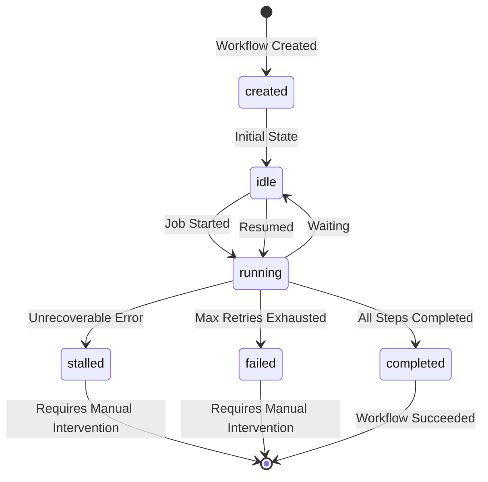

# ChronoForge

[](https://badge.fury.io/rb/chrono_forge)
[](https://github.com/radioactive-labs/chrono_forge/actions/workflows/main.yml)
[](https://opensource.org/licenses/MIT)


> A robust framework for building durable, distributed workflows in Ruby on Rails applications

ChronoForge handles long-running processes, manages state, and recovers from failures in your Rails applications. Built on ActiveJob, it keeps critical business processes resilient and traceable.

Workflows are **plain Ruby**. Ordinary `if`/`else`, loops, and early returns drive the flow. There's no declarative DSL to learn and no extra service to run, which makes ChronoForge a good fit for business processes whose shape depends on runtime state: conditional branches, iteration over data, and built-in periodic tasks (`durably_repeat`).

> **In production** at **achieve by Petra**, an investment platform in the Petra Group — where it has executed over 3.6 million workflows and 32 million durable steps across scheduled payments, investment rollovers, and membership lifecycle management.

## 🧭 Why ChronoForge

Most Rails workflow tools ask you to declare your steps up front in a DSL:

```ruby
step :send_welcome_email
step :remind_of_tasks, wait: 2.days
step :complete_onboarding, wait: 15.days
```

That reads cleanly for a fixed, linear sequence. But many business processes branch, loop, and react to data that only exists at runtime, and a declarative schema gets awkward there. ChronoForge takes the opposite approach: **a workflow is just a Ruby method.** Conditionals, iteration, early returns, and helper methods all work the way they normally do.

There is a real trade-off. Because the flow is ordinary code, ChronoForge can show the steps that **have run** (a replay/history view), but not a roadmap of steps that *haven't* run yet, which a declarative engine can. For workflows whose path isn't fixed in advance, that's a trade worth making; for a simple, fixed sequence ("send email, wait 2 days, send another"), a declarative DSL may read more cleanly, and that's a fine reason to reach for one.

### How it compares

|                              | ChronoForge          | GenevaDrive        | AcidicJob       | Temporal        |
| ---------------------------- | -------------------- | ------------------ | --------------- | --------------- |
| Programming model            | procedural (plain Ruby) | declarative DSL | declarative DSL | procedural (via SDK) |
| Built-in periodic tasks      | ✓ `durably_repeat`   | ✗                  | ✗               | ✓               |
| Pending-step visibility      | ✗ (procedural)       | ✓                  | ✓               | ✗ (procedural)  |
| Extra infrastructure         | none (DB + ActiveJob)| none               | none            | server required |
| License                      | MIT                  | LGPL / commercial  | MIT             | MIT             |

<sub>Comparison reflects each project's documented features as of mid-2026, to the best of our knowledge; corrections welcome via PR.</sub>

A few deliberate choices behind that table:

- **Periodic tasks are built in.** `durably_repeat` runs a step on a schedule until a condition holds, with automatic catch-up for missed runs, so a workflow can be its own recurring job and cron-style monitor, right alongside the rest of its logic. Without built-in support, periodic behavior usually lives in a separate scheduler that you reconcile with workflow state by hand.
- **No extra infrastructure.** ChronoForge is a gem over your existing database and ActiveJob backend. There's no separate server or daemon to operate, unlike Temporal.
- **Recovery is built into the model.** Steps are append-only history, so a crashed step leaves the workflow `stalled`, recoverable directly with `retry_later`.
- **MIT licensed.** Permissive and dependency-policy-friendly.

## 🌟 Features

- **Plain-Ruby control flow**: Branching, loops, and iteration over runtime data, without a DSL or step registry
- **Durable Execution**: Automatically tracks and recovers from failures during workflow execution
- **Periodic tasks built in**: `durably_repeat` runs a step on an interval until a condition is met, with catch-up for missed runs. Acts as a recurring task and a cron-style monitor in one
- **Wait States**: Time-based waits and condition-based waiting (`wait_until`) that survive restarts
- **State Management**: Built-in workflow state tracking with persistent context storage
- **Concurrency Control**: Advanced locking mechanisms to prevent parallel execution of the same workflow
- **Error Handling**: Error tracking with a unified, configurable [`RetryPolicy`](#-retry-policies) (including per-error-type policies)
- **Execution Logging**: Detailed logging of workflow steps and errors for visibility
- **Database-Backed**: All workflow state is persisted to ensure durability, with no extra services to run
- **ActiveJob Integration**: Compatible with all ActiveJob backends, though database-backed processors (like Solid Queue) provide the most reliable experience for long-running workflows
- **Retention & Cleanup**: A schedulable job to prune finished workflows and the unbounded logs that periodic tasks accumulate (see [Cleanup & Retention](#-cleanup--retention))

## 🖥️ Dashboard

ChronoForge has a free, mountable dashboard for visibility and recovery: workflow list, step replay timeline, context inspector, periodic-task health, wait-state age, and retry/unlock actions. It ships as a separate gem, `chrono_forge-dashboard`, so the core stays lean.

```ruby
# Gemfile
gem "chrono_forge-dashboard"

# config/routes.rb
mount ChronoForge::Dashboard::Engine, at: "/chrono_forge"
```

See [`chrono_forge-dashboard`](chrono_forge-dashboard/README.md) for setup and authentication.

## 📦 Installation

Add to your application's Gemfile:

```ruby
gem 'chrono_forge'
```

Then execute:

```bash
$ bundle install
```

Or install directly:

```bash
$ gem install chrono_forge
```

After installation, run the generator to create the necessary database migrations:

```bash
$ rails generate chrono_forge:install
$ rails db:migrate
```

### Upgrading

When upgrading ChronoForge in an application that was installed with an earlier
version, run the upgrade generator to pick up any additive schema changes, then
migrate:

```bash
$ rails generate chrono_forge:upgrade
$ rails db:migrate
```

The upgrade migration is idempotent (`if_not_exists`), so it is safe to run even
if your schema already has the index. Fresh installs get the index from the
install migration and do **not** need to run the upgrade.

## 📋 Usage

### Creating and Executing Workflows

ChronoForge workflows are ActiveJob classes that prepend the `ChronoForge::Executor` module. Each workflow can **only** accept keyword arguments:

```ruby
# Define your workflow class
class OrderProcessingWorkflow < ApplicationJob
  prepend ChronoForge::Executor
  
  def perform(order_id:, customer_id:)
    # Workflow steps...
  end
end
```

All workflows require a unique identifier when executed. This identifier is used to track and manage the workflow:

```ruby
# Execute the workflow
OrderProcessingWorkflow.perform_later(
  "order-123",                 # Unique workflow key
  order_id: "order-134",       # Custom kwargs
  customer_id: "customer-456"  # More custom kwargs
)
```

### Basic Workflow Example

Here's a complete example of a durable order processing workflow:

```ruby
class OrderProcessingWorkflow < ApplicationJob
  prepend ChronoForge::Executor

  def perform(order_id:)
    @order_id = order_id

    # Context can be used to pass and store data between executions
    context.set_once "execution_id", SecureRandom.hex

    # Wait until payment is confirmed
    wait_until :payment_confirmed?

    # Wait for potential fraud check
    wait 1.minute, :fraud_check_delay

    # Durably execute order processing
    durably_execute :process_order

    # Final steps
    durably_execute :complete_order
  end

  private

  def payment_confirmed?
    PaymentService.confirmed?(@order_id, context["execution_id"])
  end

  def process_order
    OrderProcessor.process(@order_id, context["execution_id"])
    context["processed_at"] = Time.current.iso8601
  end

  def complete_order
    OrderCompletionService.complete(@order_id, context["execution_id"])
    context["completed_at"] = Time.current.iso8601
  end
end
```

### A workflow you can't flatten into a step list

The example above is linear, but most real processes aren't. Because a ChronoForge workflow is plain Ruby, branching and dynamic iteration are just… branching and iteration:

```ruby
class OrderProcessingWorkflow < ApplicationJob
  prepend ChronoForge::Executor

  def perform(order_id:)
    @order_id = order_id

    wait_until :payment_confirmed?
    durably_execute :validate_order

    # Runtime branching: the path depends on data known only at execution time
    if context["requires_compliance_check"]
      durably_execute :run_compliance_review
      wait_until :compliance_approved?, timeout: 48.hours
    end

    # Iterate over runtime data: one durable, idempotent step per item
    context["line_item_ids"].each do |item_id|
      context["current_item_id"] = item_id
      durably_execute :fulfill_item, name: "fulfill_#{item_id}"
    end

    # Recurring notification: nudge the customer until they confirm delivery
    durably_repeat :send_delivery_reminder, every: 3.days, till: :delivery_confirmed?

    durably_execute :complete_order
  end

  private

  def fulfill_item
    FulfillmentService.fulfill(@order_id, context["current_item_id"])
  end

  def send_delivery_reminder
    OrderMailer.delivery_reminder(@order_id).deliver_later
  end

  # ... other condition and step methods ...
end
```

Each `durably_execute` is checkpointed by its step name, so on resume the completed branches and items are skipped and the workflow continues where it left off. A fixed, declared list of steps can't easily express runtime branches, a loop over a runtime-sized collection, and an open-ended recurring notification.

### Core Workflow Features

#### 🚀 Executing Workflows

ChronoForge workflows are executed through ActiveJob's standard interface with a specific parameter structure:

```ruby
# Perform the workflow immediately
OrderProcessingWorkflow.perform_now(
  "order-123",                     # Unique workflow key
  order_id: "O-123",               # Custom parameter
  customer_id: "C-456"             # Another custom parameter
)

# Or queue it for background processing
OrderProcessingWorkflow.perform_later(
  "order-123-async",               # Unique workflow key
  order_id: "O-124",
  customer_id: "C-457"
)
```

**Important:** Workflows must use keyword arguments only, not positional arguments.

#### ⚡ Durable Execution

The `durably_execute` method runs an operation with automatic retries, and skips it on replay once it has completed:

```ruby
# Basic execution
durably_execute :send_welcome_email

# With a custom retry policy
durably_execute :critical_payment_processing,
  retry_policy: RetryPolicy.new(max_attempts: 5)

# With custom name for tracking multiple calls to same method
durably_execute :upload_file, name: "profile_image_upload"

# Complex example with error-prone operation
class FileProcessingWorkflow < ApplicationJob
  prepend ChronoForge::Executor

  def perform(file_id:)
    @file_id = file_id
    
    # This might fail due to network issues, rate limits, etc.
    durably_execute :upload_to_s3, retry_policy: RetryPolicy.new(max_attempts: 5)
    
    # Process file after successful upload
    durably_execute :generate_thumbnails, retry_policy: RetryPolicy.new(max_attempts: 3)
  end

  private

  def upload_to_s3
    file = File.find(@file_id)
    S3Client.upload(file.path, bucket: 'my-bucket')
    Rails.logger.info "Successfully uploaded file #{@file_id} to S3"
  end

  def generate_thumbnails
    ThumbnailService.generate(@file_id)
  end
end
```

**Key Features:**
- **Idempotent**: Same operation won't be executed twice during replays
- **Automatic Retries**: Failed executions retry per a unified `RetryPolicy` (exponential backoff with jitter; the step default caps at 30s over 3 attempts)
- **Error Tracking**: All failures are logged with detailed error information
- **Configurable**: Pass a `retry_policy:` per call, or set a class-wide default with the `retry_policy` DSL (see [Retry Policies](#retry-policies))

#### 🔁 Retry Policies

All retrying in ChronoForge goes through a single `RetryPolicy` (`ChronoForge::Executor::RetryPolicy`). It answers two questions: *should this failure be retried?* and *how long until the next attempt?*

```ruby
RetryPolicy.new(
  max_attempts: 3,        # cap on total attempts; nil = no count cap (bounded elsewhere)
  base: 1,                # seconds; delay of the first retry
  cap: 30,                # seconds; ceiling for a single delay
  jitter: true,           # spread retries with equal jitter
  retry_on: nil           # nil = retry any StandardError; [Classes] = only those; [] = none
)
```

Backoff is exponential with equal jitter, computed once at re-enqueue time (never replayed, so it stays deterministic where it matters).

**Resolution order:**

- **`durably_execute`, `durably_repeat`, workflow-level errors**: per-call `retry_policy:` → class-level `retry_policy` default → built-in default.
- **`wait_until`**: per-call `retry_policy:` → built-in default. It deliberately does **not** inherit the class default, so a class-wide "retry everything" can't silently turn condition-evaluation bugs into retried errors.

**Built-in defaults:**

| Site | Default | Why |
|------|---------|-----|
| Steps (`durably_execute`/`durably_repeat`) | 3 attempts, cap 30s, retry any error | flaky calls fail fast |
| Workflow-level (uncaught errors) | 10 attempts, cap 600s, retry any error | tolerant window up to ~8.5 min (≈4 min typical w/ jitter) for transient infra errors; each retry replays the whole workflow from the top |
| `wait_until` condition errors | retry nothing | a raised condition is usually a bug, not transient |

**Class-wide default via the `retry_policy` DSL:**

```ruby
class ChargeWorkflow < ApplicationJob
  prepend ChronoForge::Executor
  retry_policy max_attempts: 5, base: 2, cap: 60   # applies to steps + workflow-level

  def perform
    durably_execute :charge,
      retry_policy: RetryPolicy.new(max_attempts: 8, retry_on: [Net::OpenTimeout])
    wait_until :settled?,
      retry_policy: RetryPolicy.new(retry_on: [BankApiError])
  end
end
```

**Composite policies (per-error budgets):**

Pass an **array** of policies to handle different error types differently. On a failure, the **first** policy whose `retry_on` matches the raised error applies, and each error type gets its **own attempt budget and backoff**:

```ruby
durably_execute :charge_card, retry_policy: [
  RetryPolicy.new(retry_on: [NetworkError],         max_attempts: 5),            # transient: retry hard
  RetryPolicy.new(retry_on: [RateLimitError],       max_attempts: 10, base: 5),  # back off longer
  RetryPolicy.new(retry_on: [PaymentDeclinedError], max_attempts: 1),            # fail fast, never retry
  RetryPolicy.new(retry_on: nil)                                                 # catch-all (optional), keep last
]
```

- **Order matters**: the first matching policy wins, so list specific errors first and a catch-all (`retry_on: nil`) last. An error matched by no policy is **not retried** (fails fast).
- A subclass of a listed error routes to that policy and draws from its budget.
- Per-error counts are tracked by the policy's declared errors, so the budgets are stable even if you reorder the list.
- The class-level DSL accepts the same form as positional arguments (applies to steps **and** workflow-level errors):

  ```ruby
  retry_policy RetryPolicy.new(retry_on: [NetworkError], max_attempts: 5),
               RetryPolicy.new(retry_on: nil, max_attempts: 2)
  ```

#### ⏱️ Wait States

ChronoForge supports three types of wait states, each optimized for different use cases:

**1. Time-based Waits (`wait`)**

For simple delays and scheduled pauses:

```ruby
# Simple delays
wait 30.minutes, "cooling_period"
wait 1.day, "daily_batch_interval"

# Complex workflow with multiple waits
def user_onboarding_flow
  durably_execute :send_welcome_email
  wait 1.hour, "welcome_delay"
  
  durably_execute :send_tutorial_email
  wait 2.days, "tutorial_followup"
  
  durably_execute :send_feedback_request
end
```

**2. Automated Condition Waits (`wait_until`)**

For conditions that can be automatically polled at regular intervals:

```ruby
# Wait for external API
wait_until :external_api_ready?, 
  timeout: 30.minutes, 
  check_interval: 1.minute

# Wait with retry on specific errors raised while evaluating the condition
wait_until :database_migration_complete?,
  timeout: 2.hours,
  check_interval: 30.seconds,
  retry_policy: RetryPolicy.new(retry_on: [ActiveRecord::ConnectionNotEstablished, Net::TimeoutError])

# Complex condition example
def third_party_service_ready?
  response = HTTParty.get("https://api.example.com/health")
  response.code == 200 && response.body.include?("healthy")
end

wait_until :third_party_service_ready?,
  timeout: 1.hour,
  check_interval: 2.minutes,
  retry_policy: RetryPolicy.new(retry_on: [Net::TimeoutError, Net::HTTPClientException])
```

**3. Event-driven Waits (`continue_if`)**

For conditions that depend on external events like webhooks, requiring manual workflow continuation:

```ruby
# Basic usage - wait for webhook-driven state change
continue_if :payment_confirmed?

# With custom name for better tracking
continue_if :payment_confirmed?, name: "stripe_webhook"

# Wait for manual approval
continue_if :document_approved?

# Wait for external file processing
continue_if :processing_complete?

# Multiple waits with same condition but different contexts
continue_if :external_system_ready?, name: "payment_gateway"
# ... other steps ...
continue_if :external_system_ready?, name: "inventory_system"

# Complete workflow example
class PaymentWorkflow < ApplicationJob
  prepend ChronoForge::Executor

  def perform(order_id:)
    @order_id = order_id
    
    # Initialize payment
    durably_execute :create_payment_request
    
    # Wait for external payment confirmation (webhook-driven)
    continue_if :payment_confirmed?, name: "stripe_confirmation"
    
    # Complete order after payment
    durably_execute :fulfill_order
  end

  private

  def payment_confirmed?
    PaymentService.confirmed?(@order_id)
  end
end

# Later, when webhook arrives:
PaymentService.mark_confirmed(order_id)
PaymentWorkflow.perform_later("order-#{order_id}", order_id: order_id)
```

**When to Use Each Wait Type:**

| Wait Type | Use Case | Polling | Resource Usage | Response Time |
|-----------|----------|---------|----------------|---------------|
| `wait` | Fixed delays, rate limiting | None | Minimal | Exact timing |
| `wait_until` | API readiness, data processing | Automatic | Medium | Check interval |
| `continue_if` | Webhooks, user actions, file uploads | Manual only | Minimal | Immediate |

**Key Differences:**

- **`wait`**: Time-based, no condition checking, resumes automatically
- **`wait_until`**: Condition-based with automatic polling, resumes when condition becomes true or timeout
- **`continue_if`**: Condition-based without polling, requires manual workflow retry when condition might have changed

#### 🔄 Periodic Tasks

`durably_repeat` runs periodic tasks inside a workflow. A task is scheduled at a regular interval until a condition is met, with automatic catch-up for missed executions and configurable error handling.

```ruby
class NotificationWorkflow < ApplicationJob
  prepend ChronoForge::Executor

  def perform(user_id:)
    @user_id = user_id
    
    # Send reminders every 3 days until user completes onboarding
    durably_repeat :send_reminder_email, 
      every: 3.days, 
      till: :user_onboarded?
    
    # Critical payment processing every hour - fail workflow if it fails
    durably_repeat :process_pending_payments,
      every: 1.hour,
      till: :all_payments_processed?,
      on_error: :fail_workflow
  end

  private

  def send_reminder_email(scheduled_time = nil)
    # Optional parameter receives the scheduled execution time
    if scheduled_time
      lateness = Time.current - scheduled_time
      Rails.logger.info "Reminder scheduled for #{scheduled_time}, running #{lateness.to_i}s late"
    end
    
    UserMailer.onboarding_reminder(@user_id).deliver_now
  end

  def user_onboarded?
    User.find(@user_id).onboarded?
  end

  def process_pending_payments
    PaymentProcessor.process_pending_for_user(@user_id)
  end

  def all_payments_processed?
    Payment.where(user_id: @user_id, status: :pending).empty?
  end
end
```

**Key Features:**

- **Idempotent Execution**: Each repetition gets a unique execution log, preventing duplicates during replays
- **Automatic Catch-up**: Missed executions due to downtime are automatically skipped using timeout-based fast-forwarding
- **Custom Timing**: Custom start times and precise interval scheduling
- **Error Resilience**: Individual execution failures don't break the periodic schedule
- **Configurable Error Handling**: Choose between continuing despite failures or failing the entire workflow

**Advanced Options:**

```ruby
durably_repeat :generate_daily_report,
  every: 1.day,                          # Execution interval
  till: :reports_complete?,              # Stop condition
  start_at: Date.tomorrow.beginning_of_day, # Custom start time (optional)
  retry_policy: RetryPolicy.new(max_attempts: 5), # Retry policy per execution (default: step_default)
  timeout: 2.hours,                      # Catch-up timeout (default: 1.hour)
  on_error: :fail_workflow,              # Error handling (:continue or :fail_workflow)
  name: "daily_reports"                  # Custom task name (optional)
```

**Method Parameters:**

Your periodic methods can optionally receive the scheduled execution time as their first argument:

```ruby
# Without scheduled time parameter
def cleanup_files
  FileCleanupService.perform
end

# With scheduled time parameter
def cleanup_files(scheduled_time)
  # Use scheduled time for business logic
  cleanup_date = scheduled_time.to_date
  FileCleanupService.perform(date: cleanup_date)
  
  # Log timing information
  delay = Time.current - scheduled_time
  Rails.logger.info "Cleanup was #{delay.to_i} seconds late"
end
```

#### 🔄 Workflow Context

ChronoForge provides a persistent context that survives job restarts. The context behaves like a Hash but with additional capabilities:

```ruby
# Set context values
context[:user_name] = "John Doe"
context[:status] = "processing"

# Read context values
user_name = context[:user_name]

# Using the fetch method (returns default if key doesn't exist)
status = context.fetch(:status, "pending")

# Set a value with the set method (alias for []=)
context.set(:total_amount, 99.99)

# Set a value only if the key doesn't already exist
context.set_once(:created_at, Time.current.iso8601)

# Check if a key exists
if context.key?(:user_id)
  # Do something with the user ID
end
```

The context supports serializable Ruby objects (Hash, Array, String, Integer, Float, Boolean, and nil) and validates types automatically.

Hash and Array values are stored as JSON, which has no symbols, so **symbol keys inside a stored hash come back as strings**:

```ruby
context[:totals] = { paid: 5, pending: 2 }
context[:totals]          # => { "paid" => 5, "pending" => 2 }
context[:totals]["paid"]  # => 5   (not context[:totals][:paid])
```

(The top-level context key itself is interchangeable: `context[:totals]` and `context["totals"]` refer to the same entry.)

Context is meant for **small working state**: ids, flags, timestamps, and small structures used to coordinate steps. Each value is capped at **16 KB** (a `ChronoForge::Executor::Context::ValidationError` is raised above that). Store large payloads (documents, uploads, API responses) in their own storage and keep just a reference (an id or key) in the context.

### 🛡️ Error Handling

ChronoForge automatically tracks errors and routes all retrying through a single [`RetryPolicy`](#-retry-policies). Configure it per call with `retry_policy:`, or set a class-wide default with the `retry_policy` DSL:

```ruby
class MyWorkflow < ApplicationJob
  prepend ChronoForge::Executor

  # Class-wide default for workflow-level errors and steps without an override
  retry_policy max_attempts: 5, base: 2, cap: 60

  def perform
    # Retry only network errors, up to 5 times, for this step
    durably_execute :call_external_api,
      retry_policy: RetryPolicy.new(max_attempts: 5, retry_on: [NetworkError])
  end
end
```

To make an error non-retryable, leave it out of `retry_on:` (an empty `retry_on: []` retries nothing).

## 🧪 Testing

ChronoForge is designed to be easily testable using [ChaoticJob](https://github.com/fractaledmind/chaotic_job), a testing framework that makes it simple to test complex job workflows:

1. Add ChaoticJob to your Gemfile's test group:

```ruby
group :test do
  gem 'chaotic_job'
end
```

2. Set up your test helper:

```ruby
# test_helper.rb
require 'chrono_forge'
require 'minitest/autorun'
require 'chaotic_job'
```

Example test:

```ruby
class WorkflowTest < ActiveJob::TestCase
  include ChaoticJob::Helpers

  def test_workflow_completion
    # Enqueue the job with a unique key and custom parameters
    OrderProcessingWorkflow.perform_later(
      "order-test-123",
      order_id: "O-123",
      customer_id: "C-456"
    )
    
    # Perform all enqueued jobs
    perform_all_jobs
    
    # Assert workflow completed successfully
    workflow = ChronoForge::Workflow.find_by(key: "order-test-123")
    assert workflow.completed?
    
    # Check workflow context
    assert workflow.context["processed_at"].present?
    assert workflow.context["completed_at"].present?
  end
end
```

## 🗄️ Database Schema

ChronoForge creates three main tables:

1. **chrono_forge_workflows**: Stores workflow state and context
2. **chrono_forge_execution_logs**: Tracks individual execution steps
3. **chrono_forge_error_logs**: Records detailed error information

## 🔍 When to Use ChronoForge

ChronoForge is ideal for:

- **Long-running business processes** - Order processing, account registration flows
- **Processes requiring durability** - Financial transactions, data migrations
- **Multi-step workflows** - Onboarding flows, approval processes, multi-stage jobs
- **State machines with time-based transitions** - Document approval, subscription lifecycle

## 🧠 Advanced State Management

ChronoForge workflows move through a state machine. Understanding these states and transitions helps with troubleshooting and recovery.

### Workflow State Diagram


```mermaid
stateDiagram-v2
    [*] --> created: Workflow Created
    created --> idle: Initial State
    idle --> running: Job Started
    running --> idle: Waiting
    running --> completed: All Steps Completed
    running --> failed: Max Retries Exhausted
    running --> stalled: Unrecoverable Error
    idle --> running: Resumed
    stalled --> [*]: Requires Manual Intervention
    failed --> [*]: Requires Manual Intervention
    completed --> [*]: Workflow Succeeded
```

### State Descriptions

#### Created
- **Description**: Initial state when a workflow record is first created
- **Behavior**: Transitions immediately to idle state
- **Duration**: Momentary

#### Idle
- **Description**: The workflow is waiting to be processed or between processing steps
- **Behavior**: Not locked, available to be picked up by job processor
- **Duration**: Can be minutes to days, depending on wait conditions

#### Running
- **Description**: The workflow is actively being processed
- **Identifiers**: Has locked_at and locked_by values set
- **Behavior**: Protected against concurrent execution
- **Duration**: Should be brief unless performing long operations

#### Completed
- **Description**: The workflow has successfully executed all steps
- **Identifiers**: Has completed_at timestamp, state = "completed"
- **Behavior**: Final state, no further processing
- **Typical Exit Points**: All processing completed successfully

#### Failed
- **Description**: The workflow has failed after exhausting retry attempts
- **Identifiers**: Has failure-related data in error_logs, state = "failed"
- **Behavior**: No automatic recovery, requires manual intervention
- **Typical Exit Points**: Max retries exhausted, explicit failure, non-retryable error

#### Stalled
- **Description**: The workflow encountered an unrecoverable error but wasn't explicitly failed
- **Identifiers**: Not completed, not running, has errors in error_logs
- **Behavior**: Requires manual investigation and intervention
- **Typical Exit Points**: ExecutionFailedError, unexpected exceptions, system failures

### Handling Different Workflow States

#### Recovering Stalled/Failed Workflows

Re-execute a failed or stalled workflow directly from its record. Execution resumes via replay, so
completed steps are skipped and it picks up at the step that failed:

```ruby
workflow = ChronoForge::Workflow.find_by(key: "order-123")

workflow.retry_later   # re-run asynchronously (the common case)
workflow.retry_now     # re-run inline (console/debugging)
```

Only `stalled` or `failed` workflows are retryable. `retryable?` lets you check
first, and both methods **validate up front**: calling `retry_later`
on a non-retryable workflow raises `ChronoForge::Executor::WorkflowNotRetryableError`
immediately rather than enqueuing a job that would fail in the worker:

```ruby
workflow.retryable?   # => true/false

# Bulk re-run everything that failed:
ChronoForge::Workflow.failed.find_each(&:retry_later)
```

The class-level form (`MyWorkflow.retry_now(key)` / `retry_later(key)`) still
works if you have the class and key rather than the record.

#### Monitoring Running Workflows

Long-running workflows might indicate issues:

```ruby
# Find workflows running for too long
long_running = ChronoForge::Workflow.where(state: :running)
                                   .where('locked_at < ?', 30.minutes.ago)

long_running.each do |workflow|
  # Log potential issues for investigation
  Rails.logger.warn "Workflow #{workflow.key} has been running for >30 minutes"
  
  # Optionally force unlock if you suspect deadlock
  # CAUTION: Only do this if you're certain the job is stuck
  # workflow.update!(locked_at: nil, locked_by: nil, state: :idle)
end
```

## 🧹 Cleanup & Retention

ChronoForge keeps every workflow and execution-log row indefinitely so that
replays remain idempotent. Over time two things grow without bound:

1. **Terminal workflows** (`completed` / `failed`) that are no longer needed.
2. **`durably_repeat` repetition logs**: one row per scheduled execution. A
   long-lived periodic workflow never reaches a terminal state, so its
   repetition logs accumulate indefinitely. Past repetitions (those behind the
   task's current frontier) are never read again, since each resume recomputes
   the next execution from the coordination log, so they are safe to prune (see
   the safety note below).

`ChronoForge::Cleanup` reclaims both. It is **not** run automatically; schedule
it from your own scheduler so you stay in control of retention:

```ruby
ChronoForge::Cleanup.run(
  older_than: 90.days,                       # default retention for terminal workflows (+ cascades their logs)
  completed_older_than: 30.days,             # optional: retention for completed workflows (defaults to older_than)
  failed_older_than: 180.days,               # optional: keep failures longer for debugging (defaults to older_than)
  prune_repetition_logs_older_than: 30.days, # opt-in: prune old durably_repeat logs from still-active workflows
  batch_size: 1_000                          # rows deleted per batch
)
# => { workflows: 12, execution_logs: 84, error_logs: 3, repetition_logs: 240 }
```

Notes:

- `running`, `idle`, and `stalled` workflows are **never** deleted.
- `completed_older_than` / `failed_older_than` let you keep failed workflows
  around longer than completed ones; both default to `older_than`.
- `prune_repetition_logs_older_than` is opt-in (defaults to `nil`); when unset,
  repetition logs are only removed as part of deleting their parent workflow.
  Pruning is deliberately conservative: it only removes terminal repetition logs
  that are both older than the window **and** scheduled strictly before the
  periodic task's current frontier (the coordination log's `last_execution_at`).
  Anything at or after the frontier is kept so `durably_repeat`'s catch-up
  mechanism is never disrupted, so the window is purely a retention preference
  and is safe even for yearly schedules.
- Workflow retention is measured from when a workflow became terminal, not when
  it was created. A long-running workflow that only just finished is kept for
  the full window. Completed workflows use `completed_at` (immutable); failed
  workflows use `updated_at` (they have no `completed_at`).
- The composite `[state, completed_at]` index added in this version keeps these
  scans efficient; run `chrono_forge:upgrade` if you installed an earlier
  version.

A ready-made job is bundled so you can schedule it with any recurring-job
mechanism (Solid Queue recurring tasks, sidekiq-cron, GoodJob cron, the
`whenever` gem, ...):

```ruby
ChronoForge::CleanupJob.perform_later(
  older_than_days: 90,
  failed_older_than_days: 180,
  prune_repetition_logs_older_than_days: 30
)
```

The job takes plain day counts (not `Duration` objects) so it can be driven from
a config file. For example, with Solid Queue's recurring tasks
(`config/recurring.yml`):

```yaml
production:
  chrono_forge_cleanup:
    class: ChronoForge::CleanupJob
    args: { older_than_days: 90, prune_repetition_logs_older_than_days: 30 }
    schedule: every day at 3am
```

## 🌿 Branches: parallel sub-workflows

`branch` / `spawn` / `spawn_each` / `merge_branches` let a workflow fan out into
child workflows that run concurrently, then join them when their results are
needed.

### Model

- **`branch :name do … end`** opens a named branch (a durable step). Inside the
  block, `spawn` and `spawn_each` create and immediately enqueue child workflows —
  children start running as soon as the branch block is entered.
- **`spawn :name, WorkflowClass, **kwargs`** — enqueues one child workflow.
- **`spawn_each :name, source do |item| [WorkflowClass, kwargs] end`** — enqueues
  one child per item. The block returns the class and kwargs, so one branch can
  fan out into mixed workflow types. Sources are iterated in constant memory;
  ActiveRecord relations are streamed by primary key — pass them **without** an
  explicit `.order`.
- **`automerge: true`** — joins the branch **inline at the block's close**.
  Execution does not continue past the `branch` call until every child has
  completed. Use it for "dispatch this group and wait right here."
- **`merge_branches :a, :b`** (or the singular alias `merge_branch :a`) — the
  separate join point. Open branches without `automerge`, do other work while the
  children run, then join when you need their results. `merge_branches` blocks
  until all named branches are complete.

### Worked example

```ruby
class FulfillmentWorkflow < ApplicationJob
  prepend ChronoForge::Executor

  def perform(cycle_id:)
    # automerge: the branch is joined inline, right where the block closes —
    # `perform` does not continue past it until every child has completed.
    branch :reconcile, automerge: true do
      spawn :eu, ReconcileWorkflow, region: "EU"
      spawn_each :orders, Order.pending do |order|
        order.priority? ? [PriorityOrderWorkflow, { order_id: order.id }]
                        : [OrderWorkflow, { order_id: order.id }]
      end
    end

    # For branches you want to run concurrently and join later, omit automerge
    # and use merge_branches:
    branch :invoices do
      spawn_each :unpaid, Invoice.unpaid do |inv|
        [InvoiceWorkflow, { invoice_id: inv.id }]
      end
    end
    branch :shipments do
      spawn_each :ready, Shipment.ready do |s|
        [ShipmentWorkflow, { shipment_id: s.id }]
      end
    end
    do_other_work                        # runs while :invoices and :shipments dispatch/run
    merge_branches :invoices, :shipments # join both here

    durably_execute :finalize
  end
end
```

### Caveats

> **Every branch must be joined.** A branch opened and never joined raises
> `ChronoForge::Executor::UnmergedBranchError` when the workflow tries to
> complete — fail-fast, no silently-orphaned children. Use either
> `automerge: true` or a matching `merge_branches` call.

> **The parent isn't replayed while waiting.** A lightweight
> `ChronoForge::BranchMergeJob` polls for child completion; the parent workflow
> only runs again once the branch is fully done. Polling cadence adapts to how
> many children remain.

> **`spawn_each` sources must re-enumerate deterministically across replays.**
> ActiveRecord relations are streamed by primary key (children are keyed by
> record id, so crash-resume is idempotent); a relation carrying an explicit
> `.order(...)` raises. For non-AR enumerables, items are keyed by position, so
> inserting or removing items mid-dispatch would shift keys and break idempotency.

> **`spawn_each` AR sources must have stable membership.** Dispatch streams by
> ascending primary key and resumes from the last key on crash-recovery, so a row
> that enters the relation *below* the cursor after it has passed (e.g. a
> `where(state: …)` scope whose rows mutate mid-dispatch) will never get a child.
> Point `spawn_each` at a set that is fixed for the branch's lifetime — a frozen id
> range, an append-only table, or `where(id: [...])` over a snapshot.

> **`branch` blocks cannot be lexically nested within one workflow.** Opening a
> `branch` inside another `branch` block raises `ArgumentError`; spawns belong to
> exactly one branch. (A *spawned child workflow* may open its own branches — it
> runs in its own executor — so cross-workflow nesting is fine.)

## 🚀 Development

After checking out the repo, run:

```bash
$ bin/setup                 # Install dependencies
$ bundle exec rake test     # Run the tests
$ bin/appraise              # Run the full suite of appraisals
$ bin/console               # Start an interactive console
```

The test suite uses SQLite by default and includes:
- Unit tests for core functionality
- Integration tests with ActiveJob
- Example workflow implementations

## 👥 Contributing

1. Fork the repository
2. Create your feature branch (`git checkout -b feature/my-new-feature`)
3. Commit your changes (`git commit -am 'Add some feature'`)
4. Push to the branch (`git push origin feature/my-new-feature`)
5. Create a new Pull Request

Please include tests for any new features or bug fixes.

## 📜 License

This gem is available as open source under the terms of the [MIT License](https://opensource.org/licenses/MIT).

## 📚 API Reference

### Core Workflow Methods

| Method | Purpose | Key Parameters |
|--------|---------|----------------|
| `durably_execute` | Execute method with retry logic | `method`, `retry_policy: nil`, `name: nil` |
| `wait` | Time-based pause | `duration`, `name` |
| `wait_until` | Condition-based waiting | `condition`, `timeout: 1.hour`, `check_interval: 15.minutes`, `retry_policy: nil` |
| `continue_if` | Manual continuation wait | `condition`, `name: nil` |
| `durably_repeat` | Periodic task execution | `method`, `every:`, `till:`, `start_at: nil`, `retry_policy: nil`, `timeout: 1.hour`, `on_error: :continue` |

### Context Methods

| Method | Purpose | Example |
|--------|---------|---------|
| `context[:key] = value` | Set context value | `context[:user_id] = 123` |
| `context[:key]` | Get context value | `user_id = context[:user_id]` |
| `context.set(key, value)` | Set context value (alias) | `context.set(:status, "active")` |
| `context.set_once(key, value)` | Set only if key doesn't exist | `context.set_once(:created_at, Time.current)` |
| `context.fetch(key, default)` | Get with default value | `context.fetch(:count, 0)` |
| `context.key?(key)` | Check if key exists | `context.key?(:user_id)` |

