# ChronoForge::Dashboard

[](https://badge.fury.io/rb/chrono_forge-dashboard)
[](https://github.com/radioactive-labs/chrono_forge/actions/workflows/main.yml)
[](https://opensource.org/licenses/MIT)

A mountable Rails engine that provides visibility and operational controls for ChronoForge workflows.

> Requires [`chrono_forge`](https://github.com/radioactive-labs/chrono_forge). See the [main README](https://github.com/radioactive-labs/chrono_forge#readme) for workflow documentation.

Version: `0.1.0` (early release). The UI and config API may change before `1.0`.

[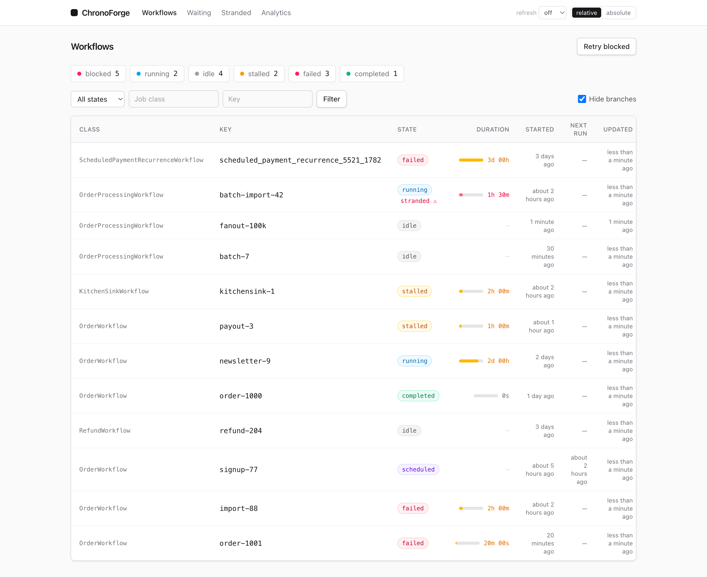](docs/screenshots/workflows.png)

## Installation

Add to your application's Gemfile (requires `chrono_forge`):

```ruby
gem "chrono_forge-dashboard"
```

Then run:

```bash
bundle install
```

## Mounting

Add to `config/routes.rb`:

```ruby
mount ChronoForge::Dashboard::Engine, at: "/chrono_forge"
```

## Screenshots

| Workflow list | Analytics |
| --- | --- |
| [](docs/screenshots/workflows.png) | [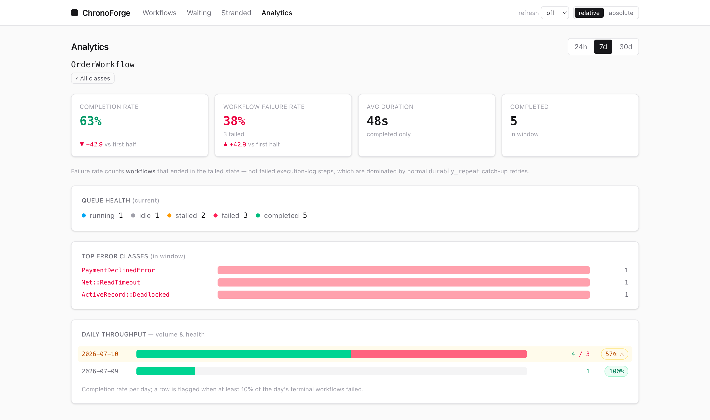](docs/screenshots/analytics.png) |
| Filter by state/class/key, keyset pagination, capped state counts, per-row duration meter (rose when a run is stranded). | Completion/failure rate with a window trend, throughput bars carrying a per-day completion-rate pill (amber-flagged on a failure spike), top errors, queue health. |

| Waiting | Stranded |
| --- | --- |
| [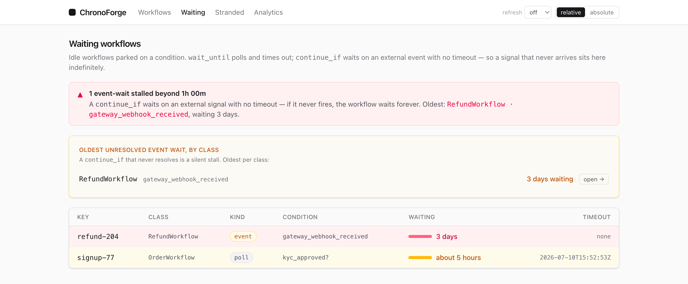](docs/screenshots/waiting.png) | [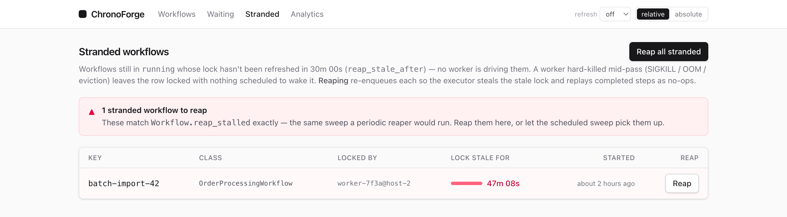](docs/screenshots/stranded.png) |
| Leads with a banner for stalled `continue_if` (event) waits — the silent stall — with event/poll pills and per-row age meters. | Workflows stuck in `running` with a stale lock — the reaper's own set. Lock-age meters, the dead worker named, per-row **Reap** and a **Reap all** background sweep. |

| Repetitions | Branches |
| --- | --- |
| [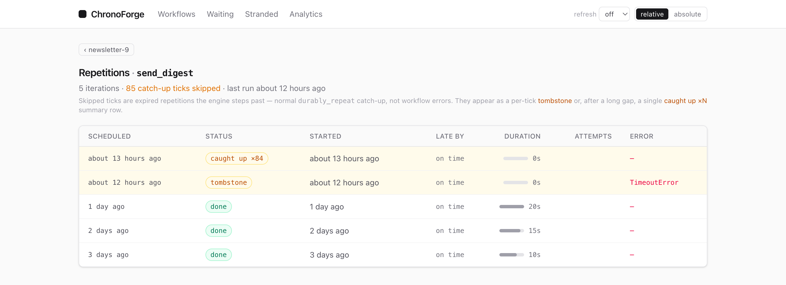](docs/screenshots/repetitions.png) | [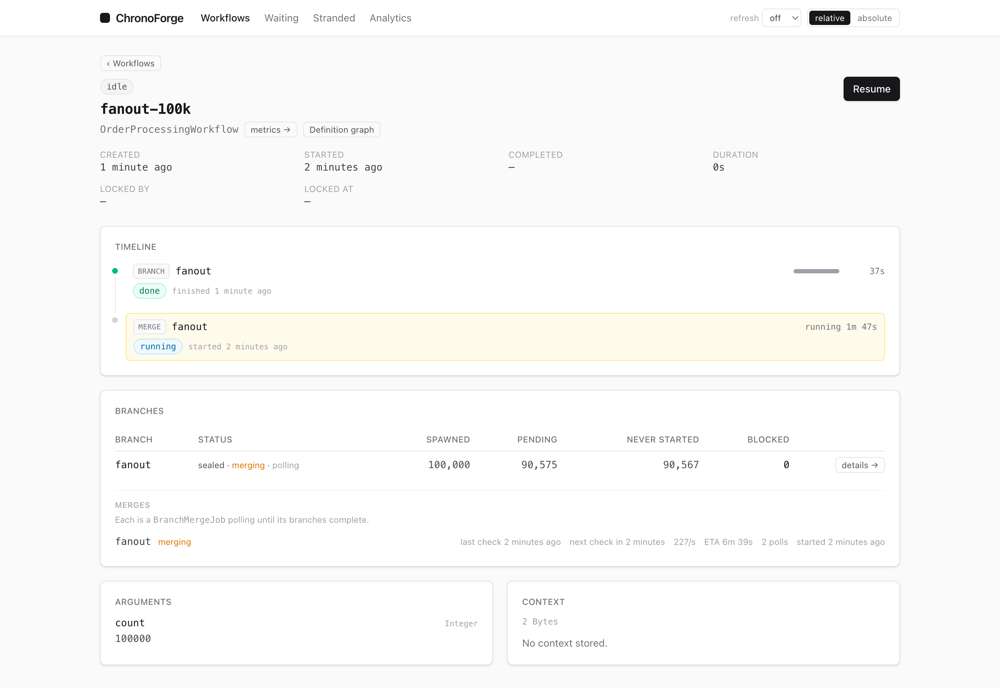](docs/screenshots/branches.png) |
| A `durably_repeat` step's per-iteration runs as status pills, with duration/lateness meters, attempts in words, and catch-up skips (per-tick tombstones or a "caught up ×N" summary). | Fan-out branches with exact **spawned / pending / never-started** counts (recorded by the poller — the immutable spawned total is cached when the branch seals) plus blocked count and merge state, and in-flight merges showing **live throughput (children/s) and ETA** while draining. |

| Branch children |
| --- |
| [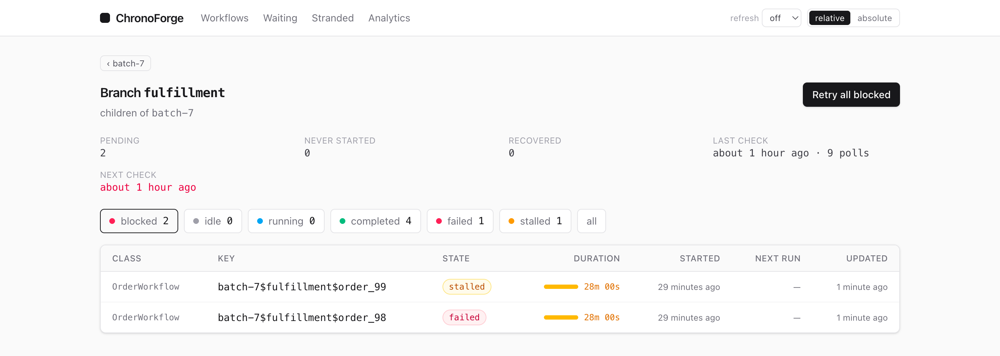](docs/screenshots/branch-children.png) |
| One branch's children with a **live stats header** (throughput/ETA, spawned, pending, never-started, dropped-child recovery) — blocked-first triage, capped state filters, retry per child. |

**Workflow detail** — step-replay timeline with errors inlined on the step that failed, periodic-task health, and arguments/context. Durations get a proportional meter (long steps stand out), attempts read in words per step kind, and a summary banner names where a blocked run stopped:

[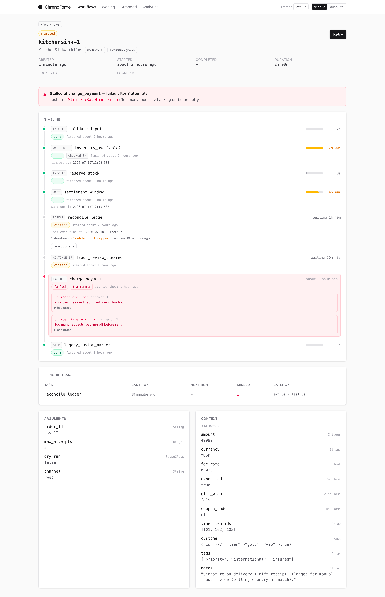](docs/screenshots/workflow-detail.png)

A workflow whose lock has gone stale is flagged **stranded** — its worker was hard-killed mid-pass, so nothing is driving the run. The banner offers **Reap**, which re-enqueues it to steal the stale lock and replay:

[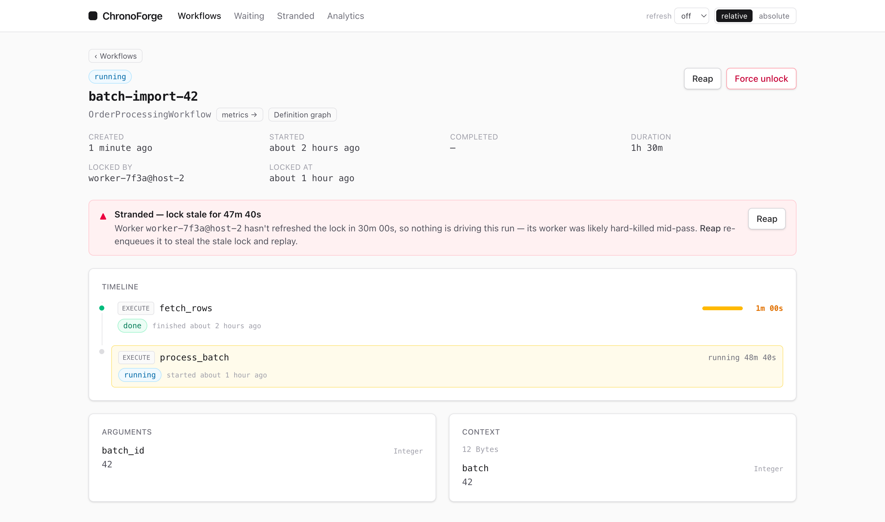](docs/screenshots/workflow-reap.png)

**Definition graph** — a per-run static DAG of the durable steps a workflow *will* run (parsed from `perform` with Prism, never executed), with the run's status painted on each node — done / in progress / failed / not-yet-reached — plus guarded edges, early-`return` exits, and unmapped steps. Tap a node or edge to inspect its step name / guard:

[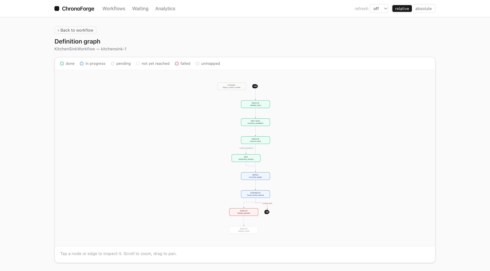](docs/screenshots/definition-graph.png)

A scheduled-payment recurrence with three reminder-ordering branches that reconverge on the charge. This run took the auto-charge branch (green); the other two branches were never reached (dimmed), the past-dismiss guard exits early to `halt`, and the final `process_payment` failed:

[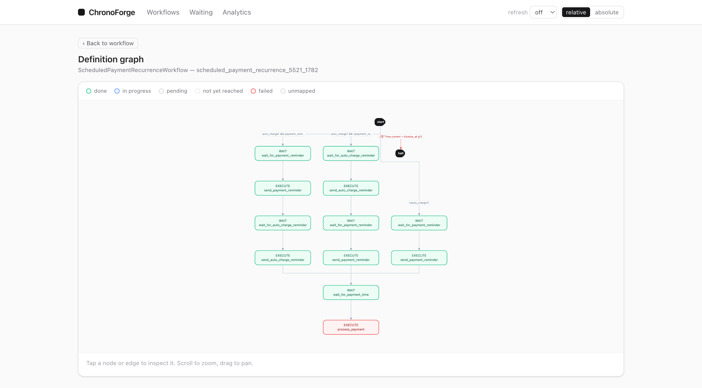](docs/screenshots/definition-graph-scheduled-payment.png)

## Authentication

The dashboard is fail-closed. If you mount it without configuring authentication, hitting any dashboard URL raises `ChronoForge::Dashboard::AuthenticationNotConfigured`. Configure one of the following in an initializer (e.g. `config/initializers/chrono_forge_dashboard.rb`).

Resolution order: custom hook, then HTTP Basic, then `:none`, else raise.

### HTTP Basic Auth

```ruby
ChronoForge::Dashboard.configure do |c|
  c.http_basic = { username: ENV["CF_USER"], password: ENV["CF_PASS"] }
end
```

### Custom Hook

```ruby
ChronoForge::Dashboard.configure do |c|
  c.authenticate { |controller| controller.head(:forbidden) unless controller.current_user&.admin? }
end
```

The block receives the current controller instance. Call `head(:forbidden)` or `redirect_to` to deny access; return normally to allow it.

### Disable (use routing constraints instead)

Set authentication to `:none` and guard the mount point yourself:

```ruby
ChronoForge::Dashboard.configure do |c|
  c.authentication = :none
end
```

```ruby
# config/routes.rb
authenticate :user, ->(u) { u.admin? } do
  mount ChronoForge::Dashboard::Engine, at: "/chrono_forge"
end
```

## Configuration

All options go in the same `configure` block as auth:

```ruby
ChronoForge::Dashboard.configure do |c|
  c.polling_interval         = 15                        # seconds; the default auto-refresh interval. 0 to disable.
  c.polling_interval_options = [0, 5, 10, 15, 30, 60, 300] # selectable intervals in the nav "refresh" control
  c.page_size                = 50                     # workflows per page
  c.long_wait_threshold      = 3600                   # seconds; wait-state ages above this are flagged
end
```

| Option | Default | Notes |
| --- | --- | --- |
| `polling_interval` | `15` | Seconds between auto-refreshes (the default). Most pages refresh in place (preserving filter text, focus, and scroll), so a draining fan-out's live throughput/ETA and counts update without a manual reload. The definition graph opts out: its interactive Cytoscape canvas can't survive an in-place morph, so it reloads fully instead and hides the refresh control. A viewer can override the interval with the nav "refresh" control (stored in a cookie). `0` disables. |
| `polling_interval_options` | `[0, 5, 10, 15, 30, 60, 300]` | Intervals (seconds; `0` = off) offered by the nav refresh control. |
| `page_size` | `50` | Workflows per page on the index. |
| `long_wait_threshold` | `3600` | Wait-state age in seconds above which a warning is shown. |

> **Stranded detection has no dashboard config.** A workflow is flagged as stranded (and listed on the **Stranded** page) purely by its lock going stale — `running` with `locked_at` older than the gem's own [`ChronoForge.config.reap_stale_after`](https://github.com/radioactive-labs/chrono_forge#readme) (default `3× max_duration`). That is exactly the criterion `ChronoForge::Workflow.reap_stalled` uses, so the dashboard flags precisely what the reaper reaps. Elapsed *runtime* is deliberately never a signal — a healthy workflow may legitimately run for months.

## Features

- **Workflow list**: state badges, filter by state/job class/workflow key, stats header showing counts by state, and a per-row duration meter (proportional across the visible page) that turns rose when a run passes its long-run threshold
- **Workflow detail**: step replay timeline showing every `durably_execute`, `wait`, `continue_if`, and `durably_repeat` run; repetitions from `durably_repeat` appear nested under their coordination step. The timeline is ranked for scanning — a summary banner names where a blocked run stopped and why, durations get a proportional meter (long steps stand out), attempts read in words per step kind (a retried execution vs. a polled wait, hidden when there's nothing to say), and a step or run still going past its threshold turns amber/rose so a stuck flow is visible at a glance
- **Definition graph**: a per-run static DAG of the durable steps a workflow *will* run — parsed from the `perform` method source with [Prism](https://github.com/ruby/prism) (never executed, never touches the DB) — with the run's live status overlaid on each node (done / in progress / pending / not-yet-reached / failed / unmapped, with per-node repeat counts and fan-out child tallies). Rendered client-side with [Cytoscape](https://js.cytoscape.org) (dagre layout): pan/zoom, and tap a node or edge to inspect its step name / guard. Reached from a "Definition graph" link on the workflow detail page. The analysis is deliberately *conservative*: `if`/`unless`/`case`/`continue_if` become guarded edges, an early `return` a dashed exit, `branch`/`spawn_each` a fan-out node, `durably_repeat` a loop node, and anything it can't resolve statically (a computed step name, a data-dependent loop, a durable call behind an unknown method) becomes a `dynamic` node with a warning rather than a confident-but-wrong graph. It also follows durable calls into helper methods in the same class, assignments, `&&`/`||`, and `case`/`in`, so a step one expression deep isn't missed. A workflow whose source can't be analyzed, or whose `perform` has no durable steps, degrades to a note, never an error.
- **Context inspector**: JSON tree view of the workflow's persistent context
- **Per-step error logs**: errors attributed to the step and attempt that raised them
- **Periodic-task health**: summary of each `durably_repeat` task (last run, next run, missed executions)
- **Wait-states view**: lists workflows in a wait state, leading with a banner when a `continue_if` event wait (no timeout, never self-resumes) blows past `long_wait_threshold` — the silent stall. Event vs poll waits read as pills, and each row's age is a meter that escalates to rose (over-threshold event) or amber (long poll)
- **Stranded view**: workflows stuck in `:running` because their lock went stale (worker hard-killed mid-pass, so nothing is left to wake them) — the same set `Workflow.reap_stalled` re-enqueues. Per-row lock-age meters, the dead worker named, one-click **Reap**, and a **Reap all stranded** background sweep. Elapsed runtime is never the signal (a healthy workflow can run for months); only a stale lock is
- **Analytics**: completion/failure-rate cards with a window trend (newer half vs older half), a daily throughput chart where each day carries a completion-rate pill and the row is flagged when its failure rate spikes (so a bad day stands out from a busy one), top error classes, and per-class queue health
- **Recovery actions**: retry a stalled or failed workflow; **reap** a workflow stranded in `:running` by a hard-killed worker (re-enqueues it so the executor steals the stale lock and replays completed steps as no-ops — the single-workflow form of `Workflow.reap_stalled`, offered in the stranded banner); force-unlock a stuck running workflow (with a duplicate-execution warning); bulk retry all blocked workflows, or bulk reap all stranded ones (both fanned out by a background job, so the request stays fast with a large backlog)

## Frontend

The dashboard is server-rendered and driven by [Turbo](https://turbo.hotwired.dev) (~94 KB, Turbo 8, vendored and served from the engine — no external host). **The host needs no npm, no build step, and no asset-pipeline configuration** — the compiled stylesheet ships with the gem. Turbo Drive handles all navigation and form submits as in-app visits (no full reloads, history-aware), so the interactive glue is a small delegated-listener vanilla JS file (`dashboard.js`). Action POSTs redirect with `303 See Other` so Turbo follows them; the auto-refresh uses Turbo's morph stream (see below). CSP-compatible (no external hosts or inline handlers).

Styles are written with [Tailwind CSS](https://tailwindcss.com) and precompiled into the shipped `dashboard.css`. Contributors editing views or styles rebuild it with the standalone compiler (no Node required):

```bash
bundle exec rake tailwind:build
```

Assets are cache-busted by a content digest, so a gem upgrade is picked up without a hard refresh.

**One exception:** the **Definition graph** page loads [Cytoscape](https://js.cytoscape.org) + [dagre](https://github.com/dagrejs/dagre) to lay out the DAG client-side (~670 KB total, loaded only on that page). All three libraries plus the init module (`definition_graph.js`) are vendored into the gem and served from the engine — no external host / CDN, and no inline `<script>` (the init is an external file), so the page stays CSP-friendly. The graph is passed as JSON in a `data-` attribute (ERB-escaped in, `JSON.parse`d out) and Cytoscape renders labels onto a canvas, so the graph itself has no HTML-injection surface. Unlike the old Mermaid text grammar, guards containing `()`, `<`, and `&&` round-trip untouched. The one place author-controlled text (labels, step names, guards) reaches the DOM is the tap-to-inspect detail panel, which HTML-escapes it before insertion. Cytoscape and dagre load only on that page.

**Auto-refresh:** the polling refresh updates the list/stats region with a Turbo **morph** stream (`<turbo-stream action="update" method="morph">`) rather than replacing its `innerHTML`. idiomorph mutates the existing nodes in place, so a table's horizontal scroll and the filter inputs' value, caret, and focus all survive a tick with no manual bookkeeping. The filter text inputs carry `data-cf-poll-preserve`; a `turbo:before-morph-element` listener skips them so an in-progress query is never reset to the last-submitted value. The refresh is scoped to the list/stats region (gated on the `data-poll-region` attribute), so the header and flash toasts are left alone — and the definition graph opts out entirely, since morphing would wipe its live Cytoscape canvas.

## Development

Run a seeded preview locally (compiles the stylesheet, then boots a demo app on `http://localhost:9876/chrono_forge`):

```bash
bin/dev          # PORT=9877 bin/dev to change the port
```

To release: bump `lib/chrono_forge/dashboard/version.rb`, commit, then run:

```bash
bin/release
```

It compiles the stylesheet, refuses to continue on a dirty tree, then runs `rake release` (tests, linter, build, git tag, and push to RubyGems). `rake build` always recompiles `dashboard.css` first, so a release never ships a stale stylesheet. Use `bundle exec rake prepare` on its own to run assets + tests + linter without releasing.
